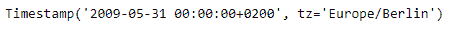

# Python | Pandas timestamp . normalize

> 原文:[https://www . geesforgeks . org/python-pandas-timestamp-normalize/](https://www.geeksforgeeks.org/python-pandas-timestamp-normalize/)

Python 是进行数据分析的优秀语言，主要是因为以数据为中心的 python 包的奇妙生态系统。 ***【熊猫】*** 就是其中一个包，让导入和分析数据变得容易多了。

熊猫 `**Timestamp.normalize()**`功能用于将时间戳归一化为午夜。该函数在保存 tz 信息的同时执行该操作。

> **语法:**时间戳. normalize()
> 
> **参数:**无
> 
> **返回:**时间戳

**示例#1:** 使用`Timestamp.normalize()`函数将时间戳规范化为午夜值。

```
# importing pandas as pd
import pandas as pd

# Create the Timestamp object
ts = pd.Timestamp(year = 2011,  month = 11, day = 21,
                  hour = 10, second = 49, tz = 'US/Central')

# Print the Timestamp object
print(ts)
```

**输出:**


现在我们将使用`Timestamp.normalize()`函数将给定时间戳中的值规范化为午夜值。

```
# normalize to midnight value
ts.isoweekday()
```

**输出:**


正如我们在输出中看到的那样，`Timestamp.normalize()`函数已经将给定的时间戳规范化为午夜。

**示例 2:** 使用`Timestamp.normalize()`函数将时间戳规范化为午夜值。

```
# importing pandas as pd
import pandas as pd

# Create the Timestamp object
ts = pd.Timestamp(year = 2009, month = 5, day = 31,
                  hour = 4, second = 49, tz = 'Europe/Berlin')

# Print the Timestamp object
print(ts)
```

**输出:**


现在我们将使用`Timestamp.normalize()`函数将给定时间戳中的值规范化为午夜值。

```
# normalize to midnight value
ts.isoweekday()
```

**输出:**



正如我们在输出中看到的那样，`Timestamp.normalize()`函数已经将给定的时间戳规范化为午夜。