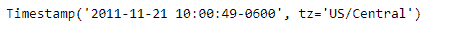
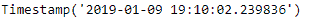
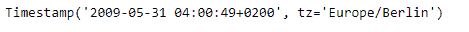
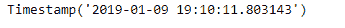

# Python | Pandas timestamp . now

> 原文:[https://www.geeksforgeeks.org/python-pandas-timestamp-now/](https://www.geeksforgeeks.org/python-pandas-timestamp-now/)

Python 是进行数据分析的优秀语言，主要是因为以数据为中心的 python 包的奇妙生态系统。 ***【熊猫】*** 就是其中一个包，让导入和分析数据变得容易多了。

熊猫 `**Timestamp.now()**`功能返回本地时区的当前时间。它相当于 datetime.now([tz])。

> **语法:** Timestamp.now()
> 
> **参数:**无
> 
> **返回:**时间戳

**示例#1:** 使用`Timestamp.now()`函数返回本地时区的当前时间。

```
# importing pandas as pd
import pandas as pd

# Create the Timestamp object
ts = pd.Timestamp(year = 2011,  month = 11, day = 21,
           hour = 10, second = 49, tz = 'US/Central')

# Print the Timestamp object
print(ts)
```

**输出:**



现在我们将使用`Timestamp.now()`函数在本地时区查找当前时间。

```
# return the current time
ts.now()
```

**输出:**



我们可以在输出中看到，`Timestamp.now()`函数返回了本地时区的当前时间。它会自动检测本地时区。

**示例 2:** 使用`Timestamp.now()`函数返回本地时区的当前时间。

```
# importing pandas as pd
import pandas as pd

# Create the Timestamp object
ts = pd.Timestamp(year = 2009, month = 5, day = 31,
       hour = 4, second = 49, tz = 'Europe/Berlin')

# Print the Timestamp object
print(ts)
```

**输出:**



现在我们将使用`Timestamp.now()`函数在本地时区查找当前时间。

```
# return the current time
ts.now()
```

**输出:**



我们可以在输出中看到，`Timestamp.now()`函数返回了本地时区的当前时间。它会自动检测本地时区。