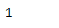
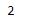

# Python | Pandas timestamp . quarter

> 原文:[https://www . geesforgeks . org/python-pandas-timestamp-quarter/](https://www.geeksforgeeks.org/python-pandas-timestamp-quarter/)

Python 是进行数据分析的优秀语言，主要是因为以数据为中心的 python 包的奇妙生态系统。 ***【熊猫】*** 就是其中一个包，让导入和分析数据变得容易多了。

Pandas `**Timestamp.quarter**`属性返回一个整数值，代表给定时间戳对象的日期所在的季度。

> **语法:**时间戳.季度
> 
> **参数:**无
> 
> **返回:**季度

**示例#1:** 使用`Timestamp.quarter`属性查找给定时间戳对象的日期位于哪个季度。

```py
# importing pandas as pd
import pandas as pd

# Create the Timestamp object
ts = pd.Timestamp(2016, 1, 1, 12, 25, 16, 28, 32)

# Print the Timestamp object
print(ts)
```

**输出:**


现在我们将使用`Timestamp.quarter`属性打印 ts 对象中日期所在的季度。

```py
# find the value of quarter
ts.quarter
```

**输出:**



我们可以在输出中看到，`Timestamp.quarter`属性已经返回 1，表示 ts 对象中的日期落在一年的第一个季度。

**示例 2:** 使用`Timestamp.quarter`属性查找给定时间戳对象的日期位于哪个季度。

```py
# importing pandas as pd
import pandas as pd

# Create the Timestamp object
ts = pd.Timestamp(year = 2009,  month = 5, day = 31, hour = 4,
                       nanosecond = 15, tz = 'Europe/Berlin')

# Print the Timestamp object
print(ts)
```

**输出:**


现在我们将使用`Timestamp.quarter`属性打印 ts 对象中日期所在的季度。

```py
# find the value of quarter
ts.quarter
```

**输出:**



我们可以在输出中看到，`Timestamp.quarter`属性已经返回 2，表示 ts 对象中的日期落在一年的第二季度。