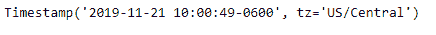
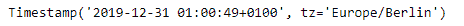

# Python |熊猫时间戳.替换

> 原文:[https://www . geesforgeks . org/python-pandas-timestamp-replace/](https://www.geeksforgeeks.org/python-pandas-timestamp-replace/)

Python 是进行数据分析的优秀语言，主要是因为以数据为中心的 python 包的奇妙生态系统。 ***【熊猫】*** 就是其中一个包，让导入和分析数据变得容易多了。

熊猫 `**Timestamp.replace()**`函数用于替换给定时间戳的成员值。该函数实现 datetime.replace，并且还处理纳秒。

> **语法:**时间戳.替换()
> 
> **参数:**
> **年:** int
> **月:** int
> **日:** int
> **小时:**int
> T15】分:int
> T18】秒:int
> T21】微秒: int
> **纳秒:**int
> T27】tzinfo:
> 
> **返回:**替换字段的时间戳

**示例#1:** 使用`Timestamp.replace()`函数替换给定时间戳中的年份值。

```py
# importing pandas as pd
import pandas as pd

# Create the Timestamp object
ts = pd.Timestamp(year = 2011,  month = 11, day = 21,
                  hour = 10, second = 49, tz = 'US/Central')

# Print the Timestamp object
print(ts)
```

**输出:**


现在我们使用`Timestamp.replace()`功能将对象中的当前年份替换为 2019 年。

```py
# replace year
ts.replace(year = 2019)
```

**输出:**



从输出中我们可以看到，`Timestamp.replace()`函数返回了一个 Timestamp 对象，年值等于 2019 年。

**示例 2:** 使用`Timestamp.replace()`函数替换给定时间戳中的年、月和小时值。

```py
# importing pandas as pd
import pandas as pd

# Create the Timestamp object
ts = pd.Timestamp(year = 2009, month = 5, day = 31,
                  hour = 4, second = 49, tz = 'Europe/Berlin')

# Print the Timestamp object
print(ts)
```

**输出:**


现在我们将使用`Timestamp.replace()`功能来替换对象中当前的年、月、小时值。

```py
# replace year, month and hour value
ts.replace(year = 2019, month = 12, hour = 1)
```

**输出:**



从输出中我们可以看到，`Timestamp.replace()`函数返回了一个 Timestamp 对象，年值等于 2019，月值等于 12，小时值等于 1。