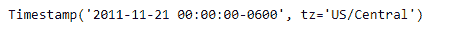
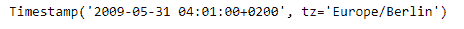

# Python | Pandas timestamp . round

> 原文:[https://www . geesforgeks . org/python-pandas-timestamp-round/](https://www.geeksforgeeks.org/python-pandas-timestamp-round/)

Python 是进行数据分析的优秀语言，主要是因为以数据为中心的 python 包的奇妙生态系统。 ***【熊猫】*** 就是其中一个包，让导入和分析数据变得容易多了。

熊猫 `**Timestamp.round()**`函数用于将给定的时间戳舍入到指定的分辨率。

> **语法:** Timestamp.round()
> 
> **参数:**
> **freq :** 表示舍入分辨率的 freq 字符串
> 
> **返回:**舍入到给定频率分辨率的新时间戳

**示例#1:** 使用`Timestamp.round()`函数将给定的时间戳舍入为每日时间序列频率。

```py
# importing pandas as pd
import pandas as pd

# Create the Timestamp object
ts = pd.Timestamp(year = 2011,  month = 11, day = 21,
                  hour = 10, second = 49, tz = 'US/Central')

# Print the Timestamp object
print(ts)
```

**输出:**


现在我们将使用`Timestamp.round()`函数将给定的时间戳对象舍入到每日频率。

```py
# round to daily frequency
ts.round(freq = 'D')
```

**输出:**



正如我们在输出中看到的那样，`Timestamp.round()`函数返回了一个 Timestamp 对象，该对象的时间序列频率被舍入到所需的分辨率。

**示例#2:** 使用`Timestamp.round()`函数将给定的时间戳舍入到精确的时间序列频率。

```py
# importing pandas as pd
import pandas as pd

# Create the Timestamp object
ts = pd.Timestamp(year = 2009, month = 5, day = 31,
       hour = 4, second = 49, tz = 'Europe/Berlin')

# Print the Timestamp object
print(ts)
```

**输出:**


现在我们将使用`Timestamp.round()`函数将给定的 Timestamp 对象舍入到微小的频率。

```py
# round to minutely frequency
ts.round(freq = 'T')
```

**输出:**



正如我们在输出中看到的那样，`Timestamp.round()`函数返回了一个 Timestamp 对象，该对象的时间序列频率被舍入到所需的分辨率。