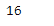
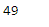

# 蟒蛇|熊猫时间戳.秒

> 原文:[https://www . geesforgeks . org/python-pandas-timestamp-second/](https://www.geeksforgeeks.org/python-pandas-timestamp-second/)

Python 是进行数据分析的优秀语言，主要是因为以数据为中心的 python 包的奇妙生态系统。 ***【熊猫】*** 就是其中一个包，让导入和分析数据变得容易多了。

熊猫 `**Timestamp.second**`属性返回一个整数值，代表给定时间戳对象中秒的值。

> **语法:**时间戳.秒
> 
> **参数:**无
> 
> **返回:**秒

**示例#1:** 使用`Timestamp.second`属性在给定的时间戳对象中查找秒的值。

```
# importing pandas as pd
import pandas as pd

# Create the Timestamp object
ts = pd.Timestamp(2016, 1, 1, 12, 25, 16, 28, 32)

# Print the Timestamp object
print(ts)
```

**输出:**


现在我们将使用`Timestamp.second`属性来查找给定对象中第二个的值。

```
# return the value of second
ts.second
```

**输出:**


正如我们在输出中看到的，`Timestamp.second`属性返回了 16，表示给定对象中第二个的值设置为 16。

**示例#2:** 使用`Timestamp.second`属性在给定的时间戳对象中查找秒的值。

```
# importing pandas as pd
import pandas as pd

# Create the Timestamp object
ts = pd.Timestamp(year = 2009,  month = 5, day = 31, hour = 4, 
                            second = 49, tz = 'Europe/Berlin')

# Print the Timestamp object
print(ts)
```

**输出:**


现在我们将使用`Timestamp.second`属性来查找给定对象中第二个的值。

```
# return the value of second
ts.second
```

**输出:**



正如我们在输出中看到的那样，`Timestamp.second`属性返回了 49，表明给定对象中第二个的值被设置为 49。