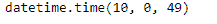
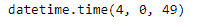

# 蟒蛇|熊猫时间戳. time

> 原文:[https://www.geeksforgeeks.org/python-pandas-timestamp-time/](https://www.geeksforgeeks.org/python-pandas-timestamp-time/)

Python 是进行数据分析的优秀语言，主要是因为以数据为中心的 python 包的奇妙生态系统。 ***【熊猫】*** 就是其中一个包，让导入和分析数据变得容易多了。

熊猫 `**Timestamp.time()**`函数返回时间相同但 tzinfo 等于无的时间对象。

> **语法:** Timestamp.time()
> 
> **参数:**无
> 
> **返回:**日期时间对象

**示例#1:** 使用`Timestamp.time()`函数从给定的 Timestamp 对象返回时间。

```
# importing pandas as pd
import pandas as pd

# Create the Timestamp object
ts = pd.Timestamp(year = 2011,  month = 11, day = 21,
           hour = 10, second = 49, tz = 'US/Central')

# Print the Timestamp object
print(ts)
```

**输出:**


现在我们将使用`Timestamp.time()`功能返回时间

```
# return time
ts.time()
```

**输出:**



正如我们在输出中看到的那样，`Timestamp.time()`函数返回了给定 Timestamp 对象的时间。请注意，给定的对象不知道时区。

**示例 2:** 使用`Timestamp.time()`函数返回给定时间戳对象的时间。

```
# importing pandas as pd
import pandas as pd

# Create the Timestamp object
ts = pd.Timestamp(year = 2009, month = 5, day = 31,
       hour = 4, second = 49, tz = 'Europe/Berlin')

# Print the Timestamp object
print(ts)
```

**输出:**


现在我们将使用`Timestamp.time()`功能返回时间

```
# return time
ts.time()
```

**输出:**



正如我们在输出中看到的那样，`Timestamp.time()`函数返回了给定 Timestamp 对象的时间。请注意，给定的对象不知道时区。