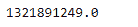
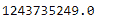

# Python | Pandas timestamp . timestamp

> 原文:[https://www . geesforgeks . org/python-pandas-timestamp-timestamp/](https://www.geeksforgeeks.org/python-pandas-timestamp-timestamp/)

Python 是进行数据分析的优秀语言，主要是因为以数据为中心的 python 包的奇妙生态系统。 ***【熊猫】*** 就是其中一个包，让导入和分析数据变得容易多了。

Pandas `**Timestamp.timestamp()**`函数返回自 1970 年 1 月 1 日以来经过的时间，用秒数表示。那个零时刻被称为纪元。

> **语法:** Timestamp.timestamp()
> 
> **参数:**无
> 
> **返回:**从零时刻开始的秒数

**示例#1:** 使用`Timestamp.timestamp()`函数返回给定时间戳对象从零时刻开始经过的秒数。

```py
# importing pandas as pd
import pandas as pd

# Create the Timestamp object
ts = pd.Timestamp(year = 2011,  month = 11, day = 21, 
                  hour = 10, second = 49, tz = 'US/Central') 

# Print the Timestamp object
print(ts)
```

**输出:**


现在我们将使用`Timestamp.timestamp()`功能来查找已经过去的秒数。

```py
# return the number of seconds
ts.timestamp()
```

**输出:**



正如我们在输出中看到的那样，`Timestamp.timestamp()`函数返回了一个浮点值，表示自给定时间戳对象的纪元以来已经过去了多少秒。

**示例#2:** 使用`Timestamp.timestamp()`函数返回给定时间戳对象自零时刻以来经过的秒数。

```py
# importing pandas as pd
import pandas as pd

# Create the Timestamp object
ts = pd.Timestamp(year = 2009, month = 5, day = 31, 
                  hour = 4, second = 49, tz = 'Europe/Berlin')

# Print the Timestamp object
print(ts)
```

**输出:**


现在我们将使用`Timestamp.timestamp()`功能来查找已经过去的秒数。

```py
# return the number of seconds
ts.timestamp()
```

**输出:**



正如我们在输出中所看到的那样，`Timestamp.timestamp()`函数返回了一个浮点值，表示自给定时间戳对象的纪元以来已经过去了多少秒。