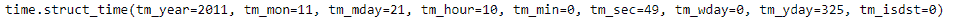
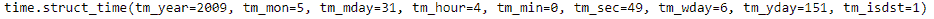

# Python | Pandas timestamp . time tuple

> 原文:[https://www . geesforgeks . org/python-pandas-timestamp-time tuple/](https://www.geeksforgeeks.org/python-pandas-timestamp-timetuple/)

Python 是进行数据分析的优秀语言，主要是因为以数据为中心的 python 包的奇妙生态系统。 ***【熊猫】*** 就是其中一个包，让导入和分析数据变得容易多了。

熊猫 `**Timestamp.timetuple()**`函数为给定的时间戳对象返回一个时间元组。返回的元组包含从年、月到小时和秒的值。时间元组与 time.localtime()兼容。

> **语法:** Timestamp.timetuple()
> 
> **参数:**无
> 
> **返回:**时间元组

**示例#1:** 使用`Timestamp.timetuple()`函数返回给定时间戳对象的时间元组。

```
# importing pandas as pd
import pandas as pd

# Create the Timestamp object
ts = pd.Timestamp(year = 2011,  month = 11, day = 21, 
                  hour = 10, second = 49, tz = 'US/Central') 

# Print the Timestamp object
print(ts)
```

**输出:**


现在我们将使用`Timestamp.timetuple()`函数返回一个时间元组。

```
# return time tuple
ts.timetuple()
```

**输出:**



正如我们在输出中看到的那样，`Timestamp.timetuple()`函数已经为给定的 Timestamp 对象返回了一个元组，该元组包含年、月、日等值。

**示例#2:** 使用`Timestamp.timetuple()`函数返回给定时间戳对象的时间元组。

```
# importing pandas as pd
import pandas as pd

# Create the Timestamp object
ts = pd.Timestamp(year = 2009, month = 5, day = 31, 
                  hour = 4, second = 49, tz = 'Europe/Berlin')

# Print the Timestamp object
print(ts)
```

**输出:**


现在我们将使用`Timestamp.timetuple()`函数返回一个时间元组。

```
# return time tuple
ts.timetuple()
```

**输出:**



正如我们在输出中看到的那样，`Timestamp.timetuple()`函数已经为给定的 Timestamp 对象返回了一个元组，该元组包含年、月、日等值。