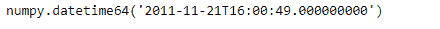
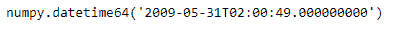

# Python | Pandas timestamp . to _ datetime 64

> 原文:[https://www . geesforgeks . org/python-pandas-timestamp-to _ datetime 64/](https://www.geeksforgeeks.org/python-pandas-timestamp-to_datetime64/)

Python 是进行数据分析的优秀语言，主要是因为以数据为中心的 python 包的奇妙生态系统。 ***【熊猫】*** 就是其中一个包，让导入和分析数据变得容易多了。

熊猫 `**Timestamp.to_datetime64()**`函数为给定的时间戳对象返回一个精度为“ns”的 numpy.datetime64 对象。

> **语法:** Timestamp.to_datetime64()
> 
> **参数:**无
> 
> **返回:** numpy.datetime64 对象

**示例#1:** 使用`Timestamp.to_datetime64()`函数为给定的时间戳对象返回 numpy.datetime64 对象。

```py
# importing pandas as pd
import pandas as pd

# Create the Timestamp object
ts = pd.Timestamp(year = 2011,  month = 11, day = 21, 
                  hour = 10, second = 49, tz = 'US/Central') 

# Print the Timestamp object
print(ts)
```

**输出:**


现在我们将使用`Timestamp.to_datetime64()`函数为给定的时间戳返回一个 numpy.datetime64 对象。

```py
# return numpy.datetime64 object
ts.to_datetime64()
```

**输出:**

正如我们在输出中看到的那样，`Timestamp.to_datetime64()`函数为给定的时间戳对象返回了一个精度为“ns”的 numpy.datetime64 对象。

**示例#2:** 使用`Timestamp.to_datetime64()`函数为给定的时间戳对象返回 numpy.datetime64 对象。

```py
# importing pandas as pd
import pandas as pd

# Create the Timestamp object
ts = pd.Timestamp(year = 2009, month = 5, day = 31, 
                  hour = 4, second = 49, tz = 'Europe/Berlin')

# Print the Timestamp object
print(ts)
```

**输出:**


现在我们将使用`Timestamp.to_datetime64()`函数为给定的时间戳返回一个 numpy.datetime64 对象。

```py
# return numpy.datetime64 object
ts.to_datetime64()
```

**输出:**



正如我们在输出中看到的那样，`Timestamp.to_datetime64()`函数为给定的时间戳对象返回了一个精度为“ns”的 numpy.datetime64 对象。