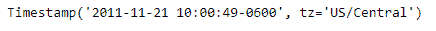
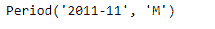
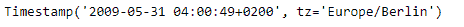
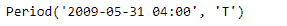

# Python | Pandas timestamp . to _ period

> 原文:[https://www . geesforgeks . org/python-pandas-timestamp-to _ period/](https://www.geeksforgeeks.org/python-pandas-timestamp-to_period/)

Python 是进行数据分析的优秀语言，主要是因为以数据为中心的 python 包的奇妙生态系统。 ***【熊猫】*** 就是其中一个包，让导入和分析数据变得容易多了。

熊猫 `**Timestamp.to_period()**`函数返回一个周期对象，给定的时间戳是该对象的一个观察值。

> **语法:** Timestamp.to_period()
> 
> **参数:**
> **频率:**时间序列频率
> 
> **返回:**期间对象

**示例#1:** 使用`Timestamp.to_period()`函数将给定的时间戳转换为周期对象。

```py
# importing pandas as pd
import pandas as pd

# Create the Timestamp object
ts = pd.Timestamp(year = 2011,  month = 11, day = 21, 
                  hour = 10, second = 49, tz = 'US/Central') 

# Print the Timestamp object
print(ts)
```

**输出:**



现在我们将使用`Timestamp.to_period()`函数将给定的时间戳转换为周期。

```py
# convert to period
# we have applied monthly frequency
ts.to_period(freq ='M')
```

**输出:**



我们可以在输出中看到，`Timestamp.to_period()`函数已经将给定的 Timestamp 对象转换为 period 对象。

**示例 2:** 使用`Timestamp.to_period()`函数将给定的时间戳转换为周期对象。

```py
# importing pandas as pd
import pandas as pd

# Create the Timestamp object
ts = pd.Timestamp(year = 2009, month = 5, day = 31, 
                  hour = 4, second = 49, tz = 'Europe/Berlin')

# Print the Timestamp object
print(ts)
```

**输出:**



现在我们将使用`Timestamp.to_period()`函数将给定的时间戳转换为周期。

```py
# convert to period
# we have applied minutely frequency
ts.to_period(freq ='T')
```

**输出:**



我们可以在输出中看到，`Timestamp.to_period()`函数已经将给定的 Timestamp 对象转换为 period 对象。