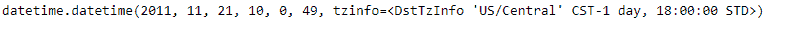
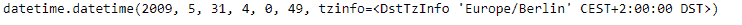

# Python | Pandas timestamp . to _ pydatetime

> 原文:[https://www . geesforgeks . org/python-pandas-timestamp-to _ pydatetime/](https://www.geeksforgeeks.org/python-pandas-timestamp-to_pydatetime/)

Python 是进行数据分析的优秀语言，主要是因为以数据为中心的 python 包的奇妙生态系统。 ***【熊猫】*** 就是其中一个包，让导入和分析数据变得容易多了。

熊猫 `**Timestamp.to_pydatetime()**`函数将时间戳对象转换为本机 Python 日期时间对象。

> **语法:** Timestamp.to_pydatetime()
> 
> **参数:**
> 
> **警告:**布尔
> 
> **返回:**日期时间对象

**示例#1:** 使用`Timestamp.to_pydatetime()`函数将给定的时间戳转换为本机 python datetime 对象。

```
# importing pandas as pd
import pandas as pd

# Create the Timestamp object
ts = pd.Timestamp(year = 2011,  month = 11, day = 21, 
                  hour = 10, second = 49, tz = 'US/Central') 

# Print the Timestamp object
print(ts)
```

**输出:**


现在我们将使用`Timestamp.to_pydatetime()`函数将给定的 Timestamp 转换为 python 的 datetime 对象。

```
# convert to datetime
ts.to_pydatetime()
```

**输出:**



正如我们在输出中看到的那样，`Timestamp.to_pydatetime()`函数返回了一个由给定的 Timestamp 对象构造的原生 python datetime 对象。

**示例#2:** 使用`Timestamp.to_pydatetime()`函数将给定的时间戳转换为本机 python datetime 对象。

```
# importing pandas as pd
import pandas as pd

# Create the Timestamp object
ts = pd.Timestamp(year = 2009, month = 5, day = 31, 
                  hour = 4, second = 49, tz = 'Europe/Berlin')

# Print the Timestamp object
print(ts)
```

**输出:**


现在我们将使用`Timestamp.to_pydatetime()`函数将给定的 Timestamp 转换为 python 的 datetime 对象。

```
# convert to datetime
ts.to_pydatetime()
```

**输出:**



正如我们在输出中看到的那样，`Timestamp.to_pydatetime()`函数返回了一个由给定的 Timestamp 对象构造的原生 python datetime 对象。