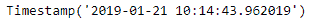
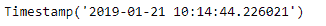

# Python | Pandas timestamp . today

> 原文:[https://www . geesforgeks . org/python-pandas-timestamp-today/](https://www.geeksforgeeks.org/python-pandas-timestamp-today/)

Python 是进行数据分析的优秀语言，主要是因为以数据为中心的 python 包的奇妙生态系统。 ***【熊猫】*** 就是其中一个包，让导入和分析数据变得容易多了。

熊猫 `**Timestamp.today()**`功能返回本地时区的当前时间。这与 datetime.today()的不同之处在于，它可以本地化为传递的时区。

> **语法:** Timestamp.today(cls，tz=None)
> 
> **参数:**
> **tz :** 要本地化的时区
> 
> **返回:**今天的时间

**示例#1:** 使用`Timestamp.today()`函数返回本地时区的当前时间。

```
# importing pandas as pd
import pandas as pd

# Create the Timestamp object
ts = pd.Timestamp(year = 2011,  month = 11, day = 21, 
                  hour = 10, second = 49, tz = 'US/Central') 

# Print the Timestamp object
print(ts)
```

**输出:**


现在我们将使用`Timestamp.today()`函数返回本地时区的当前时间。

```
# return current time
ts.today()
```

**输出:**



我们可以在输出中看到，`Timestamp.today()`函数返回了本地时区的当前时间。

**示例 2:** 使用`Timestamp.today()`函数返回本地时区的当前时间。

```
# importing pandas as pd
import pandas as pd

# Create the Timestamp object
ts = pd.Timestamp(year = 2009, month = 5, day = 31, 
                  hour = 4, second = 49, tz = 'Europe/Berlin')

# Print the Timestamp object
print(ts)
```

**输出:**


现在我们将使用`Timestamp.today()`函数返回本地时区的当前时间。

```
# return current time
ts.today()
```

**输出:**



我们可以在输出中看到，`Timestamp.today()`函数返回了本地时区的当前时间。