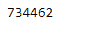
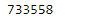

# Python | Pandas timestamp . to ordinal

> 原文:[https://www . geesforgeks . org/python-pandas-timestamp-toordinal/](https://www.geeksforgeeks.org/python-pandas-timestamp-toordinal/)

Python 是进行数据分析的优秀语言，主要是因为以数据为中心的 python 包的奇妙生态系统。 ***【熊猫】*** 就是其中一个包，让导入和分析数据变得容易多了。

熊猫 `**Timestamp.toordinal()**`函数返回前视公历序数。第一年的 1 月 1 日是第一天。函数返回给定时间戳对象的序号值。

> **语法:**时间戳. toordinal()
> 
> **参数:**无
> 
> **返回:**序数

**示例#1:** 使用`Timestamp.toordinal()`函数返回给定时间戳对象的公历序数。

```
# importing pandas as pd
import pandas as pd

# Create the Timestamp object
ts = pd.Timestamp(year = 2011,  month = 11, day = 21, 
                  hour = 10, second = 49, tz = 'US/Central') 

# Print the Timestamp object
print(ts)
```

**输出:**


现在我们将使用`Timestamp.toordinal()`函数返回给定时间戳对象的公历序数。

```
# return ordinal
ts.toordinal()
```

**输出:**



正如我们在输出中看到的那样，`Timestamp.toordinal()`函数返回了给定时间戳的公历序数。

**示例#2:** 使用`Timestamp.toordinal()`函数返回给定时间戳对象的公历序数。

```
# importing pandas as pd
import pandas as pd

# Create the Timestamp object
ts = pd.Timestamp(year = 2009, month = 5, day = 31, 
                  hour = 4, second = 49, tz = 'Europe/Berlin')

# Print the Timestamp object
print(ts)
```

**输出:**


现在我们将使用`Timestamp.toordinal()`函数返回给定时间戳对象的公历序数。

```
# return ordinal
ts.toordinal()
```

**输出:**



正如我们在输出中看到的那样，`Timestamp.toordinal()`函数返回了给定时间戳的公历序数。