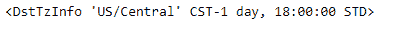
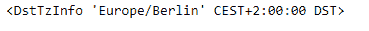

# Python | Pandas timestamp . tz

> 原文:[https://www.geeksforgeeks.org/python-pandas-timestamp-tz/](https://www.geeksforgeeks.org/python-pandas-timestamp-tz/)

Python 是进行数据分析的优秀语言，主要是因为以数据为中心的 python 包的奇妙生态系统。 ***【熊猫】*** 就是其中一个包，让导入和分析数据变得容易多了。

熊猫 `**Timestamp.tz**`属性用于检查给定时间戳对象的时区。如果未设置时区，则返回无。

> **语法:**时间戳. tz
> 
> **参数:**无
> 
> **返回:**时区

**示例#1:** 使用`Timestamp.tz`属性查找给定时间戳对象的时区。

```py
# importing pandas as pd
import pandas as pd

# Create the Timestamp object
ts = pd.Timestamp(year = 2011,  month = 11, day = 21,
           hour = 10, second = 49, tz = 'US/Central')

# Print the Timestamp object
print(ts)
```

**输出:**


现在我们将使用`Timestamp.tz`属性来查找给定对象的时区。

```py
# return the timezone
ts.tz
```

**输出:**



正如我们在输出中看到的那样，`Timestamp.tz`属性返回了‘美国/中央’，表示给定时间戳对象中的时间基于‘美国/中央’时区。

**示例 2:** 使用`Timestamp.tz`属性查找给定时间戳对象的时区。

```py
# importing pandas as pd
import pandas as pd

# Create the Timestamp object
ts = pd.Timestamp(year = 2009,  month = 5, day = 31, 
        hour = 4, second = 49, tz = 'Europe/Berlin')

# Print the Timestamp object
print(ts)
```

**输出:**


现在我们将使用`Timestamp.tz`属性来查找给定对象的时区。

```py
# return the timezone
ts.tz
```

**输出:**



正如我们在输出中看到的那样，`Timestamp.tz`属性返回了“欧洲/柏林”，表示给定 Timestamp 对象中的时间基于“欧洲/柏林”时区。