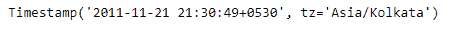

# Python | Pandas timestamp . tz _ convert

> 原文:[https://www . geesforgeks . org/python-pandas-timestamp-tz _ convert/](https://www.geeksforgeeks.org/python-pandas-timestamp-tz_convert/)

Python 是进行数据分析的优秀语言，主要是因为以数据为中心的 python 包的奇妙生态系统。 ***【熊猫】*** 就是其中一个包，让导入和分析数据变得容易多了。

熊猫 `**Timestamp.tz_convert()**`功能将感知时间标记转换为另一个时区。该函数将所需时区作为我们要转换到的输入。

> **语法:** Timestamp.tz_convert()
> 
> **参数:**
> **tz :** 时间戳将转换到的时区。无将删除保存世界协调时时间的时区。
> 
> **返回:**已转换:时间戳

**示例#1:** 使用`Timestamp.tz_convert()`函数将给定的知晓时间戳对象转换为“亚洲/加尔各答”。

```
# importing pandas as pd
import pandas as pd

# Create the Timestamp object
ts = pd.Timestamp(year = 2011,  month = 11, day = 21, 
                  hour = 10, second = 49, tz = 'US/Central') 

# Print the Timestamp object
print(ts)
```

**输出:**


现在我们将使用`Timestamp.tz_convert()`函数将 ts 对象的时区转换为“亚洲/加尔各答”。

```
# convert to 'Asia / Kolkata'
ts.tz_convert(tz = 'Asia/Kolkata')
```

**输出:**



正如我们在输出中看到的那样，`Timestamp.tz_convert()`函数已经将给定对象的时区转换为“亚洲/加尔各答”。

**示例#2:** 使用`Timestamp.tz_convert()`函数将给定的知晓时间戳对象转换为“美国/太平洋”。

```
# importing pandas as pd
import pandas as pd

# Create the Timestamp object
ts = pd.Timestamp(year = 2009, month = 5, day = 31, 
                  hour = 4, second = 49, tz = 'Europe/Berlin')

# Print the Timestamp object
print(ts)
```

**输出:**


现在我们将使用`Timestamp.tz_convert()`函数将 ts 对象的时区转换为“美国/太平洋”。

```
# convert to 'US / Pacific'
ts.tz_convert(tz = 'US/Pacific')
```

**输出:**


正如我们在输出中看到的那样，`Timestamp.tz_convert()`函数已经将给定对象的时区转换为“美国/太平洋”。