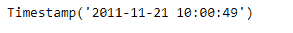
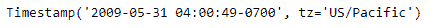

# Python | Pandas timestamp . tz _ localize

> 原文:[https://www . geesforgeks . org/python-pandas-timestamp-tz _ local/](https://www.geeksforgeeks.org/python-pandas-timestamp-tz_localize/)

Python 是进行数据分析的优秀语言，主要是因为以数据为中心的 python 包的奇妙生态系统。 ***【熊猫】*** 就是其中一个包，让导入和分析数据变得容易多了。

pandas**Timestamp . tz _ localize()**函数将天真的 Timestamp 转换为本地时区，或者从知晓 tz 的 Timestamp 中移除时区。

> **语法:**Timestamp . tz _ localize()
> **参数:**
> **tz:**Timestamp 将转换为的时区。无将删除持有本地时间的时区。
> **模棱两可:** bool，【NaT】，默认“raise”
> **错误:**“raise”，“要挟”，默认“raise”
> **返回:**本地化:时间戳

**示例#1:** 使用 Timestamp.tz_localize()函数将知道 tz 的 Timestamp 转换为天真的 Timestamp 对象。

## 蟒蛇 3

```py
# importing pandas as pd
import pandas as pd

# Create the Timestamp object
ts = pd.Timestamp(year = 2011,  month = 11, day = 21,
                  hour = 10, second = 49, tz = 'US/Central')

# Print the Timestamp object
print(ts)
```

**输出:**


现在我们将使用 Timestamp.tz_localize()函数将知道 tz 的时间戳转换为天真的时间戳。

## 蟒蛇 3

```py
# convert to naive Timestamp
ts.tz_localize(tz = None)
```

**输出:**



正如我们在输出中看到的，Timestamp.tz_localize()函数已经将给定的 Timestamp 转换为一个简单的 Timestamp。

**示例#2:** 使用 Timestamp.tz_localize()函数将给定的天真时间戳转换为知晓 tz 的 Timestamp 对象。将时区设置为“美国/太平洋”。

## 蟒蛇 3

```py
# importing pandas as pd
import pandas as pd

# Create the Timestamp object
ts = pd.Timestamp(year = 2009, month = 5, day = 31,
                             hour = 4, second = 49)

# Print the Timestamp object
print(ts)
```

**输出:**


现在我们将使用 Timestamp.tz_localize()函数将 ts 对象的时区设置为“美国/太平洋”。

## 蟒蛇 3

```py
# set to 'US / Pacific'
ts.tz_localize(tz = 'US/Pacific')
```

**输出:**



正如我们在输出中看到的，Timestamp.tz_localize()函数已经将给定对象的时区设置为“美国/太平洋”。