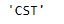
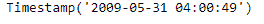
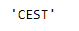

# Python | Pandas timestamp . tzname

> 原文:[https://www . geesforgeks . org/python-pandas-timestamp-tzname/](https://www.geeksforgeeks.org/python-pandas-timestamp-tzname/)

Python 是进行数据分析的优秀语言，主要是因为以数据为中心的 python 包的奇妙生态系统。 ***【熊猫】*** 就是其中一个包，让导入和分析数据变得容易多了。

Pandas `**Timestamp.tzname()**`函数返回 self.tzinfo.tzname(self)，即给定时间戳所属时区的名称。

> **语法:** Timestamp.tzname()
> 
> **参数:**无
> 
> **返回:**时区名称

**示例#1:** 使用`Timestamp.tzname()`函数返回给定时间戳对象设置到的时区名称。

```py
# importing pandas as pd
import pandas as pd

# Create the Timestamp object
ts = pd.Timestamp(year = 2011,  month = 11, day = 21, 
                  hour = 10, second = 49, tz = 'US/Central') 

# Print the Timestamp object
print(ts)
```

**输出:**


现在我们将使用`Timestamp.tzname()`函数返回时区的名称。

```py
# return the timezone info
ts.tzname()
```

**输出:**



正如我们在输出中看到的那样，`Timestamp.tzname()`函数返回了给定时间戳对象所属时区的名称。“中央标准时间”

**的“中央标准时间”列表示例#2:** 使用`Timestamp.tzname()`函数返回给定时间戳对象已设置到的时区名称。

```py
# importing pandas as pd
import pandas as pd

# Create the Timestamp object
ts = pd.Timestamp(year = 2009, month = 5, day = 31, 
                  hour = 4, second = 49, tz = 'Europe/Berlin')

# Print the Timestamp object
print(ts)
```

**输出:**



现在我们将使用`Timestamp.tzname()`函数返回时区的名称。

```py
# return the timezone info
ts.tzname()
```

**输出:**



正如我们在输出中看到的那样，`Timestamp.tzname()`函数返回了给定时间戳对象所属时区的名称。“CEST”代表“中欧夏令时”。