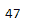
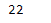

# Python |熊猫 Timestamp.week

> 原文:[https://www.geeksforgeeks.org/python-pandas-timestamp-week/](https://www.geeksforgeeks.org/python-pandas-timestamp-week/)

Python 是进行数据分析的优秀语言，主要是因为以数据为中心的 python 包的奇妙生态系统。 ***【熊猫】*** 就是其中一个包，让导入和分析数据变得容易多了。

Pandas `**Timestamp.week**`属性返回一个整数值，该整数值是给定 Timestamp 对象的日期所在的周的序数。

> **语法:**时间戳.周
> 
> **参数:**无
> 
> **返程:**周

**示例#1:** 使用`Timestamp.week`属性查找给定 Timestamp 对象的日期所在的周的序号值。

```py
# importing pandas as pd
import pandas as pd

# Create the Timestamp object
ts = pd.Timestamp(year = 2011,  month = 11, day = 21,
           hour = 10, second = 49, tz = 'US/Central')

# Print the Timestamp object
print(ts)
```

**输出:**


现在我们将使用`Timestamp.week`属性来查找周的序数

```py
# return the week number
ts.week
```

**输出:**



正如我们在输出中看到的那样，`Timestamp.week`属性返回了 47，表示给定 Timestamp 对象中的日期属于一年中的第 47 周。

**示例#2:** 使用`Timestamp.week`属性查找给定时间戳对象的日期所在的周的序号值。

```py
# importing pandas as pd
import pandas as pd

# Create the Timestamp object
ts = pd.Timestamp(year = 2009,  month = 5, day = 31,
        hour = 4, second = 49, tz = 'Europe/Berlin')

# Print the Timestamp object
print(ts)
```

**输出:**


现在我们将使用`Timestamp.week`属性来查找周的序数

```py
# return the week number
ts.week
```

**输出:**



正如我们在输出中看到的那样，`Timestamp.week`属性返回了 22，表示给定 Timestamp 对象中的日期落在一年中的第 22 周。