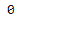

# Python | Pandas timestamp . weekday

> 原文:[https://www . geesforgeks . org/python-pandas-timestamp-weekday/](https://www.geeksforgeeks.org/python-pandas-timestamp-weekday/)

Python 是进行数据分析的优秀语言，主要是因为以数据为中心的 python 包的奇妙生态系统。 ***【熊猫】*** 就是其中一个包，让导入和分析数据变得容易多了。

Pandas `**Timestamp.weekday()**`函数返回给定 Timestamp 对象中的日期所代表的星期几。周一== 0 …周日== 6。

> **语法:** Timestamp.weekday()
> 
> **参数:**无
> 
> **返回:**一周中的某一天

**示例#1:** 使用`Timestamp.weekday()`函数返回给定时间戳对象中日期的星期几。

```
# importing pandas as pd
import pandas as pd

# Create the Timestamp object
ts = pd.Timestamp(year = 2011,  month = 11, day = 21, 
                  hour = 10, second = 49, tz = 'US/Central') 

# Print the Timestamp object
print(ts)
```

**输出:**


现在我们将使用`Timestamp.weekday()`功能返回星期几。

```
# return the day of the week
ts.weekday()
```

**输出:**



我们可以在输出中看到，`Timestamp.weekday()`函数已经返回 0，表示当天是星期一。

**示例 2:** 使用`Timestamp.weekday()`函数返回给定时间戳对象中日期的星期几。

```
# importing pandas as pd
import pandas as pd

# Create the Timestamp object
ts = pd.Timestamp(year = 2009, month = 5, day = 31, 
                  hour = 4, second = 49, tz = 'Europe/Berlin')

# Print the Timestamp object
print(ts)
```

**输出:**


现在我们将使用`Timestamp.weekday()`功能返回星期几。

```
# return the day of the week
ts.weekday()
```

**输出:**


我们可以在输出中看到，`Timestamp.weekday()`函数已经返回了 6，表示当天是周日。