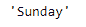

# Python | Pandas timestamp . weekday _ name

> 原文:[https://www . geesforgeks . org/python-pandas-timestamp-weekday _ name/](https://www.geeksforgeeks.org/python-pandas-timestamp-weekday_name/)

Python 是进行数据分析的优秀语言，主要是因为以数据为中心的 python 包的奇妙生态系统。 ***【熊猫】*** 就是其中一个包，让导入和分析数据变得容易多了。

熊猫 `**Timestamp.weekday_name**`属性返回时间戳对象中给定日期的星期名称。

> **语法:** Timestamp.weekday_name
> 
> **参数:**无
> 
> **返回:**星期几的名称

**示例#1:** 使用`Timestamp.weekday_name`属性在 Timestamp 对象中查找给定日期的工作日名称。

```py
# importing pandas as pd
import pandas as pd

# Create the Timestamp object
ts = pd.Timestamp(year = 2011,  month = 11, day = 21, 
           hour = 10, second = 49, tz = 'US/Central')

# Print the Timestamp object
print(ts)
```

**输出:**


现在我们将使用`Timestamp.weekday_name`属性来查找工作日名称。

```py
# return the name of the weekday
ts.weekday_name
```

**输出:**


正如我们在输出中看到的那样，`Timestamp.weekday_name`属性返回了“星期一”，表明给定时间戳对象中的日期是“星期一”。

**示例#2:** 使用`Timestamp.weekday_name`属性在 Timestamp 对象中查找给定日期的工作日名称。

```py
# importing pandas as pd
import pandas as pd

# Create the Timestamp object
ts = pd.Timestamp(year = 2009,  month = 5, day = 31,
        hour = 4, second = 49, tz = 'Europe/Berlin')

# Print the Timestamp object
print(ts)
```

**输出:**


现在我们将使用`Timestamp.weekday_name`属性来查找工作日名称。

```py
# return the name of the weekday
ts.weekday_name
```

**输出:**



正如我们在输出中看到的那样，`Timestamp.weekday_name`属性返回了‘Sunday’，表示给定 Timestamp 对象中的日期是‘Sunday’。