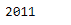
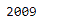

# 蟒蛇|熊猫时间戳.年份

> 原文:[https://www.geeksforgeeks.org/python-pandas-timestamp-year/](https://www.geeksforgeeks.org/python-pandas-timestamp-year/)

Python 是进行数据分析的优秀语言，主要是因为以数据为中心的 python 包的奇妙生态系统。 ***【熊猫】*** 就是其中一个包，让导入和分析数据变得容易多了。

熊猫 `**Timestamp.year**`属性返回给定时间戳对象中日期所在的年份。

> **语法:**时间戳.年份
> 
> **参数:**无
> 
> **回归:**年

**示例#1:** 使用`Timestamp.year`属性查找给定时间戳对象中的日期所在的年份。

```
# importing pandas as pd
import pandas as pd

# Create the Timestamp object
ts = pd.Timestamp(year = 2011,  month = 11, day = 21,
           hour = 10, second = 49, tz = 'US/Central')

# Print the Timestamp object
print(ts)
```

**输出:**


现在我们将使用`Timestamp.year`属性来查找日期的年份值。

```
# return the year
ts.year
```

**输出:**



我们可以在输出中看到，`Timestamp.year`属性返回了 2011 年，表示给定 Timestamp 对象中日期的年份值是 2011 年。

**示例#2:** 使用`Timestamp.year`属性查找给定时间戳对象中的日期所在的年份。

```
# importing pandas as pd
import pandas as pd

# Create the Timestamp object
ts = pd.Timestamp(year = 2009,  month = 5, day = 31, 
        hour = 4, second = 49, tz = 'Europe/Berlin')

# Print the Timestamp object
print(ts)
```

**输出:**


现在我们将使用`Timestamp.year`属性来查找日期的年份值。

```
# return the year
ts.year
```

**输出:**



正如我们在输出中看到的那样，`Timestamp.year`属性返回了 2009，表明给定 Timestamp 对象中日期的年份值是 2009。