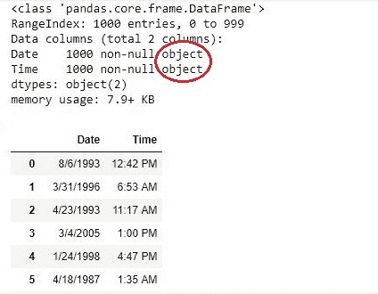
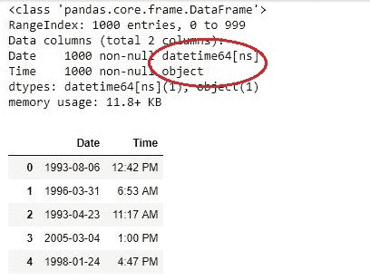
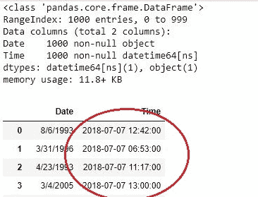

# Python | pandas . to _ datetime()

> 原文:[https://www.geeksforgeeks.org/python-pandas-to_datetime/](https://www.geeksforgeeks.org/python-pandas-to_datetime/)

当导入 csv 文件并制作数据框时，文件中的日期时间对象被读取为字符串对象，而不是日期时间对象，因此很难对字符串而不是日期时间对象执行时差等操作。Pandas `**to_datetime()**` 方法有助于将字符串 Date 时间转换为 Python Date 时间对象。

> **语法:**
> 
> **pandas.to_datetime** (arg，errors='raise '，dayfirst=False，yearfirst=False，utc=None，box=True，format=None，exact=True，unit=None，infer _ datetime _ format = False，origin='unix '，cache=False)
> 
> **参数:**
> 
> **参数:**要转换为日期时间对象的整数、字符串、浮点、列表或字典对象。
> **dayfirst:** 布尔值，如果为 True，则放置 dayfirst。
> **第一年:**布尔值，如果为真，则将第一年置于第一位。
> **世界协调时:**布尔值，如果为真，则返回以世界协调时为单位的时间。
> **格式:**字符串输入，告诉日、月、年的位置。

**返回类型:**日期时间对象序列。

所用 CSV 文件的链接，点击这里的[。](https://media.geeksforgeeks.org/wp-content/uploads/todatetime.csv)

**示例#1:** 字符串到日期
在以下示例中，读取 csv 文件，并将数据框的日期列从字符串对象转换为日期时间对象。

```
# importing pandas package
import pandas as pd

# making data frame from csv file
data = pd.read_csv("todatetime.csv")

# overwriting data after changing format
data["Date"]= pd.to_datetime(data["Date"])

# info of data
data.info()

# display
data
```

**输出:**
如图所示，“日期”列的数据类型是对象，但在使用 to_datetime()后，它被转换为日期时间对象。

**操作前-**



**运算后-**



**例 2:** 转换时间时异常
时间对象也可以用此方法转换。但是因为在时间栏中没有指定日期，所以熊猫会自动将**放入今天的日期**中。

```
# importing pandas package
import pandas as pd

# making data frame from csv file
data = pd.read_csv("todatetime.csv")

# overwriting data after changing format
data["Time"]= pd.to_datetime(data["Time"])

# info of data
data.info()

# display
data
```

**输出:**
如输出所示，一个日期(2018-07-07)即今天的日期已经添加了 Date time 对象。

