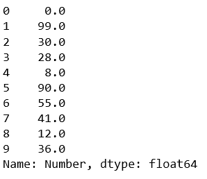
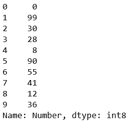
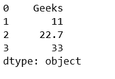
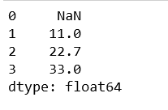

# Python | pandas.to_numeric 方法

> 原文:[https://www . geesforgeks . org/python-pandas-to _ numeric-method/](https://www.geeksforgeeks.org/python-pandas-to_numeric-method/)

Python 是进行数据分析的优秀语言，主要是因为以数据为中心的 python 包的奇妙生态系统。Pandas 就是其中之一，它让数据的导入和分析变得更加容易。

`**pandas.to_numeric()**`是 Pandas 中的通用函数之一，用于将参数转换为数值类型。

> **语法:** pandas.to_numeric(arg，错误='raise '，downcast=None)
> 
> **参数:**
> **arg :** 列表、元组、一维数组或系列
> **错误:** { '忽略'，'提高'，'要挟' }，默认'提高'
> **- >** 如果'提高'，则无效解析将引发异常
> **- >** 如果'要挟'，则无效解析将设置为 NaN
> **- >** 如果'忽略'，则 如果数据已成功转换为数字数据类型，则根据以下规则将结果数据转换为可能的最小数字数据类型:
> **- >** “整数”或“有符号”:最小有符号 int 数据类型(min。 :np.int8)
> **- >** “无符号”:最小的无符号 int dtype (min。:NP . uint 8)
> **->**“float”:最小 float 数据类型(min。:np.float32)
> 
> **如果解析成功，返回:**数值。请注意，返回类型取决于输入。如果是系列，则为系列，否则为系列。

**代码#1:**

首先观察这个数据集。我们将使用这个数据的“数字”列来制作数列，然后进行运算。

```py
# importing pandas module 
import pandas as pd 

# making data frame 
df = pd.read_csv("https://media.geeksforgeeks.org/wp-content/uploads/nba.csv") 

df.head(10)
```


在数字列上调用序列构造函数，然后选择前 10 行。

```py
# importing pandas module 
import pandas as pd 

# making data frame 
df = pd.read_csv("nba.csv") 

# get first ten 'numbers'
ser = pd.Series(df['Number']).head(10)
ser
```

**输出:**


使用 pd.to_numeric()方法。请注意，通过使用向下转换=“有符号”，所有值都将转换为整数。

```py
pd.to_numeric(ser, downcast ='signed')
```

**输出:**


**代码#2:** 使用错误=“忽略”。它将忽略所有非数值。

```py
# importing pandas module 
import pandas as pd 

# get first ten 'numbers'
ser = pd.Series(['Geeks', 11, 22.7, 33])

pd.to_numeric(ser, errors ='ignore')
```

**输出:**


**代码#3:** 使用错误= '要挟'。它将用 NaN 替换所有非数值。

```py
# importing pandas module 
import pandas as pd 

# get first ten 'numbers'
ser = pd.Series(['Geeks', 11, 22.7, 33])

pd.to_numeric(ser, errors ='coerce')
```

**输出:**
