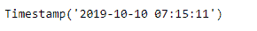
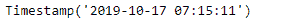
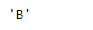
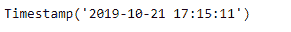

# Python | Pandas tseries . offset . business day . name

> 原文:[https://www . geesforgeks . org/python-pandas-ts eries-offset-business day-name/](https://www.geeksforgeeks.org/python-pandas-tseries-offsets-businessday-name/)

日期偏移量是熊猫中用于日期范围的一种标准的日期增量。就我们传递的关键字 args 而言，它的工作原理与 relativedelta 完全一样。日期偏移的工作方式如下，每个偏移指定一组符合日期偏移的日期。例如， *Bday* 将该集合定义为工作日(M-F)的日期集合。

可以创建日期偏移量来将日期向前移动给定的有效日期数。例如，可以将 *Bday(2)* 添加到日期中，使其向前移动两个工作日。如果日期没有在有效日期开始，则首先将其移动到有效日期，然后创建偏移。

Pandas `**tseries.offsets.BusinessDay.name**`属性允许您在函数中使用偏移量以简化操作，而不是导入和初始化类。它还返回应用于偏移对象的频率名称。

> **语法:**pandas . tseries . offers . business day . name
> 
> **参数:**无
> 
> **返回:**名称

**示例#1:** 使用`pandas.tseries.offsets.BusinessDay.name`属性返回应用于给定偏移对象的频率名称。

```py
# importing pandas as pd
import pandas as pd

# Creating Timestamp
ts = pd.Timestamp('2019-10-10 07:15:11')

# Create an offset of 5 Business days
bd = pd.tseries.offsets.BusinessDay(n = 5)

# Print the Timestamp
print(ts)

# Print the DateOffset
print(bd)
```

**输出:**




现在，我们将向给定的时间戳对象添加工作日偏移量，以增加日期时间值。我们还将打印应用于给定偏移对象的频率名称。

```py
# Adding the Business day offset to the given timestamp
new_timestamp = ts + bd

# Print the updated timestamp
print(new_timestamp)

# Print the name of the frequency applied 
# on the given offset object
print(bd.name)
```

**输出:**





正如我们在输出中看到的，我们已经成功地创建了一个 5 个工作日的偏移量，并将其添加到给定的时间戳中。我们还打印了应用于给定偏移对象的频率名称。

**示例 2 :** 使用`pandas.tseries.offsets.BusinessDay.name`属性返回应用于给定偏移对象的频率名称。

```py
# importing pandas as pd
import pandas as pd

# Creating Timestamp
ts = pd.Timestamp('2019-10-10 07:15:11')

# Create an offset of 10 Business days and 10 hours
bd = pd.tseries.offsets.BusinessDay(offset = datetime.timedelta(days = 10, hours = 10))

# Print the Timestamp
print(ts)

# Print the DateOffset
print(bd)
```

**输出:**


现在，我们将向给定的时间戳对象添加工作日偏移量，以增加日期时间值。我们还将打印应用于给定偏移对象的频率名称。

```py
# Adding the Business day offset to the given timestamp
new_timestamp = ts + bd

# Print the updated timestamp
print(new_timestamp)

# Print the name of the frequency applied 
# on the given offset object
print(bd.name)
```

**输出:**




正如我们在输出中看到的，我们已经成功地创建了 10 个工作日& 10 个小时的偏移量，并将其添加到给定的时间戳中。我们还打印了应用于给定偏移对象的频率名称。