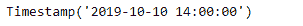
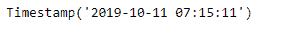
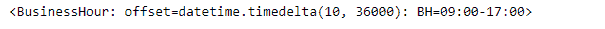
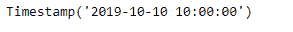

# Python | Pandas tseries . offset . business hour . next _ bday

> 原文:[https://www . geesforgeks . org/python-pandas-ts eries-offers-business hour-next _ bday/](https://www.geeksforgeeks.org/python-pandas-tseries-offsets-businesshour-next_bday/)

日期偏移量是熊猫中用于日期范围的一种标准的日期增量。就我们传递的关键字 args 而言，它的工作原理与 relativedelta 完全一样。日期偏移的工作方式如下，每个偏移指定一组符合日期偏移的日期。例如， *Bday* 将该集合定义为工作日(M-F)的日期集合。

可以创建日期偏移量来将日期向前移动给定的有效日期数。例如，可以将 *Bday(2)* 添加到日期中，使其提前两个工作日。如果日期没有在有效日期开始，则首先将其移动到有效日期，然后创建偏移。

熊猫 `**tseries.offsets.BusinessHour.next_bday**`功能用于移至下一个工作日。

> **语法:**pandas . tseries . offers . business hour . next _ bday
> 
> **参数:**无
> 
> **返回:**偏移量

**示例#1:** 使用`pandas.tseries.offsets.BusinessHour.next_bday`功能将给定的时间戳移动到下一个工作日。

```
# importing pandas as pd
import pandas as pd

# Creating Timestamp
ts = pd.Timestamp('2019-10-10 07:15:11')

# Create an offset of 5 Business hours
bh = pd.tseries.offsets.BusinessHour(n = 5)

# Print the Timestamp
print(ts)

# Print the Offset
print(bh)
```

**输出:**


现在，我们将业务时间偏移量添加到给定的时间戳对象中，以增加日期时间值。我们还会将给定的时间戳移到下一个工作日。

```
# Adding the Business hour offset to the given timestamp
new_timestamp = ts + bh

# Print the updated timestamp
print(new_timestamp)

# Move the timestamp to next
# business day
result = ts + bh.next_bday

# Print the result
print(result)
```

**输出:**





正如我们在输出中看到的，我们已经成功地创建了一个 5 个工作小时的偏移量，并将其添加到给定的时间戳中。我们还将给定的时间戳移到了下一个工作日。

**示例 2:** 使用`pandas.tseries.offsets.BusinessHour()`功能创建 10 天 5 个工作时间的偏移量。

```
# importing pandas as pd
import pandas as pd

# Creating Timestamp
ts = pd.Timestamp('2019-10-10 07:15:11')

# Create an offset
bh = pd.tseries.offsets.BusinessHour(offset = datetime.timedelta(days = 10, hours = 10))

# Print the Timestamp
print(ts)

# Print the Offset
print(bh)
```

**输出:**




现在，我们将业务时间偏移量添加到给定的时间戳对象中，以增加日期时间值。我们还会将给定的时间戳移到下一个工作日。

```
# Adding the Business hour offset to the given timestamp
new_timestamp = ts + bh

# Print the updated timestamp
print(new_timestamp)

# Move the timestamp to next
# business day
result = ts + bh.next_bday

# Print the result
print(result)
```

**输出:**




**注意:**即使我们已经向函数传递了 10 天，请注意工作时间值是如何变化的。

正如我们在输出中看到的，我们已经成功地创建了一个偏移量，并将其添加到给定的时间戳中。我们还将给定的时间戳移到了下一个工作日。