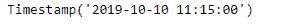
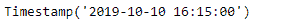
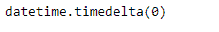
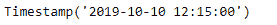
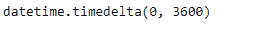

# Python | Pandas tseries . offset . business hour . offset

> 原文:[https://www . geesforgeks . org/python-pandas-ts eries-offset-business hour-offset/](https://www.geeksforgeeks.org/python-pandas-tseries-offsets-businesshour-offset/)

日期偏移量是熊猫中用于日期范围的一种标准的日期增量。就我们传递的关键字 args 而言，它的工作原理与 relativedelta 完全一样。日期偏移的工作方式如下，每个偏移指定一组符合日期偏移的日期。例如， *Bday* 将该集合定义为工作日(M-F)的日期集合。

可以创建日期偏移量来将日期向前移动给定的有效日期数。例如，可以将 *Bday(2)* 添加到日期中，使其向前移动两个工作日。如果日期没有在有效日期开始，则首先将其移动到有效日期，然后创建偏移。

熊猫 `**tseries.offsets.BusinessHour.offset**`属性是自我的别名。_ 偏移量。它返回一个 datetime.timedelta 值。

> **语法:**pandas . tseries . offset . business hour . offset
> 
> **参数:**无
> 
> **返回:**日期时间时间增量

**示例#1:** 使用`pandas.tseries.offsets.BusinessHour.offset`属性返回自我。给定偏移量的偏移量值。

```
# importing pandas as pd
import pandas as pd

# Creating Timestamp
ts = pd.Timestamp('2019-10-10 11:15:00')

# Create an offset of 5 Business hours
bh = pd.tseries.offsets.BusinessHour(n = 5)

# Print the Timestamp
print(ts)

# Print the Offset
print(bh)
```

**输出:**




现在，我们将业务时间偏移量添加到给定的时间戳对象中，以增加日期时间值。我们将打印偏移值。

```
# Adding the Business hour offset to the given timestamp
new_timestamp = ts + bh

# Print the updated timestamp
print(new_timestamp)

# print the offset
print(bh.offset)
```

**输出:**





正如我们在输出中看到的，我们已经成功地创建了一个偏移量，并将其添加到给定的时间戳中。我们也印刷了自我。_ 偏移值。

**例 2:** 使用`pandas.tseries.offsets.BusinessHour.offset`属性返回自我。给定偏移量的偏移量值。

```
# importing pandas as pd
import pandas as pd

# Creating Timestamp
ts = pd.Timestamp('2019-10-10 11:15:00')

# Create an offset
bh = pd.tseries.offsets.BusinessHour(offset = datetime.timedelta(hours = 1))

# Print the Timestamp
print(ts)

# Print the Offset
print(bh)
```

**输出:**


现在，我们将业务时间偏移量添加到给定的时间戳对象中，以增加日期时间值。我们将打印自我。_ 偏移值。

```
# Adding the Business hour offset to the given timestamp
new_timestamp = ts + bh

# Print the updated timestamp
print(new_timestamp)

# print the offset
print(bh.offset)
```

**输出:**





正如我们在输出中看到的，我们已经成功地创建了一个偏移量，并将其添加到给定的时间戳中。我们也印刷了自我。_ 偏移值。