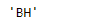

# Python | Pandas tseries . offset . business hour . rule _ code

> 原文:[https://www . geesforgeks . org/python-pandas-ts eries-offset-business hour-rule _ code/](https://www.geeksforgeeks.org/python-pandas-tseries-offsets-businesshour-rule_code/)

日期偏移量是熊猫中用于日期范围的一种标准的日期增量。就我们传递的关键字 args 而言，它的工作原理与 relativedelta 完全一样。日期偏移的工作方式如下，每个偏移指定一组符合日期偏移的日期。例如， *Bday* 将该集合定义为工作日(M-F)的日期集合。

可以创建日期偏移量来将日期向前移动给定的有效日期数。例如，可以将 *Bday(2)* 添加到日期中，使其向前移动两个工作日。如果日期没有在有效日期开始，则首先将其移动到有效日期，然后创建偏移。

Pandas `**tseries.offsets.BusinessHour.rule_code**`属性将应用于给定偏移的频率的规则代码作为字符串返回。

> **语法:**pandas . tseries . offset . business hour . rule _ code
> 
> **参数:**无
> 
> **返回:**规则 _ 代码

**示例#1:** 使用`pandas.tseries.offsets.BusinessHour.rule_code`属性以字符串形式返回应用于给定偏移的频率的规则代码。

```py
# importing pandas as pd
import pandas as pd

# Creating Timestamp
ts = pd.Timestamp('2019-10-10 11:15:00')

# Create an offset
bh = pd.tseries.offsets.BusinessHour(n = 5)

# Print the Timestamp
print(ts)

# Print the Offset
print(bh)
```

**输出:**


现在，我们将业务时间偏移量添加到给定的时间戳对象中，以增加日期时间值。我们还将把应用于给定偏移的频率的 rule_code 打印为字符串。

```py
# Adding the Business hour offset to the given timestamp
new_timestamp = ts + bh

# Print the updated timestamp
print(new_timestamp)

# print the rule_code of the frequency
# applied as string
print(bh.name)
```

**输出:**




正如我们在输出中看到的，我们已经成功地创建了一个偏移量，并将其添加到给定的时间戳中。我们还将应用于给定偏移的频率的 rule_code 打印为字符串。

**示例#2:** 使用`pandas.tseries.offsets.BusinessHour.rule_code`属性以字符串形式返回应用于给定偏移的频率的规则代码。

```py
# importing pandas as pd
import pandas as pd

# Creating Timestamp
ts = pd.Timestamp('2019-10-10 11:15:00')

# Create an offset
bh = pd.tseries.offsets.BusinessHour(offset = datetime.timedelta(hours = 1))

# Print the Timestamp
print(ts)

# Print the Offset
print(bh)
```

**输出:**


现在，我们将业务时间偏移量添加到给定的时间戳对象中，以增加日期时间值。我们还将把应用于给定偏移的频率的 rule_code 打印为字符串。

```py
# Adding the Business hour offset to the given timestamp
new_timestamp = ts + bh

# Print the updated timestamp
print(new_timestamp)

# print the rule_code of the frequency
# applied as string
print(bh.rule_code)
```

**输出:**


正如我们在输出中看到的，我们已经成功地创建了一个偏移量，并将其添加到给定的时间戳中。我们还将应用于给定偏移的频率的 rule_code 打印为字符串。