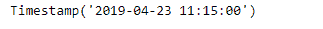
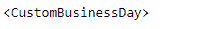
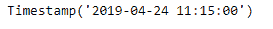
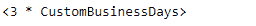
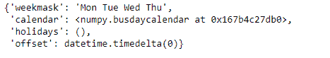

# Python | Pandas tseries . offset . custom business day . kwds

> 原文:[https://www . geesforgeks . org/python-pandas-ts eries-offset-custom business day-kwds/](https://www.geeksforgeeks.org/python-pandas-tseries-offsets-custombusinessday-kwds/)

日期偏移量是熊猫中用于日期范围的一种标准的日期增量。就我们传递的关键字 args 而言，它的工作原理与 relativedelta 完全一样。日期偏移的工作方式如下，每个偏移指定一组符合日期偏移的日期。例如， *Bday* 将该集合定义为工作日(M-F)的日期集合。

可以创建日期偏移量来将日期向前移动给定的有效日期数。例如，可以将 *Bday(2)* 添加到日期中，使其提前两个工作日。如果日期没有在有效日期开始，则首先将其移动到有效日期，然后创建偏移。

Pandas `**tseries.offsets.CustomBusinessDay.kwds**`属性返回应用于给定偏移对象的关键字参数。

> **语法:**pandas . tseries . offset . custom business day . kwds
> 
> **参数:**无
> 
> **返回:**关键字参数

**示例#1:** 使用`pandas.tseries.offsets.CustomBusinessDay.kwds`属性返回应用于给定偏移对象的关键字参数。

```py
# importing pandas as pd
import pandas as pd

# Creating Timestamp
ts = pd.Timestamp('2019-4-23 11:15:00')

# Create an offset
cbd = pd.tseries.offsets.CustomBusinessDay(weekmask = 'Mon Tue Wed')

# Print the Timestamp
print(ts)

# Print the Offset
print(cbd)
```

**输出:**





现在，我们将向给定的时间戳对象添加偏移量，以增加日期时间值。我们还将打印应用于给定偏移对象的关键字参数。

```py
# Adding the offset to the given timestamp
new_timestamp = ts + cbd

# Print the updated timestamp
print(new_timestamp)

# find the keyword argument applied on 
# the given offset
result = cbd.kwds

# print the result
print(result)
```

**输出:**




正如我们在输出中看到的，我们已经成功地创建了一个偏移量，并将其添加到给定的时间戳中。我们还打印了应用于给定偏移对象的关键字参数。

**示例#2:** 使用`pandas.tseries.offsets.CustomBusinessDay.kwds`属性返回应用于给定偏移对象的关键字参数。

```py
# importing pandas as pd
import pandas as pd

# Creating Timestamp
ts = pd.Timestamp('2019-4-23 11:15:00')

# Create an offset
cbd = pd.tseries.offsets.CustomBusinessDay(n = 3, weekmask = 'Mon Tue Wed Thu')

# Print the Timestamp
print(ts)

# Print the Offset
print(cbd)
```

**输出:**




现在，我们将向给定的时间戳对象添加偏移量，以增加日期时间值。我们还将打印应用于给定偏移对象的关键字参数。

```py
# Adding the offset to the given timestamp
new_timestamp = ts + cbd

# Print the updated timestamp
print(new_timestamp)

# find the keyword argument applied on 
# the given offset
result = cbd.kwds

# print the result
print(result)
```

**输出:**




正如我们在输出中看到的，我们已经成功地创建了一个偏移量，并将其添加到给定的时间戳中。我们还将应用于给定偏移对象的频率打印为字符串。