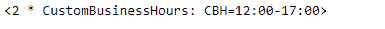
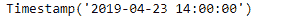
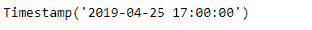
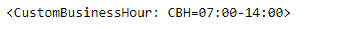
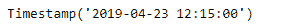
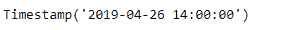

# Python | Pandas tseries . offset . custombusiness hour . roll back

> 原文:[https://www . geesforgeks . org/python-pandas-ts eries-offset-custombusiness hour-roll back/](https://www.geeksforgeeks.org/python-pandas-tseries-offsets-custombusinesshour-rollback/)

日期偏移量是熊猫中用于日期范围的一种标准的日期增量。就我们传递的关键字 args 而言，它的工作原理与 relativedelta 完全一样。日期偏移的工作方式如下，每个偏移指定一组符合日期偏移的日期。例如， *Bday* 将该集合定义为工作日(M-F)的日期集合。

可以创建日期偏移量来将日期向前移动给定的有效日期数。例如，可以将 *Bday(2)* 添加到日期中，使其提前两个工作日。如果日期没有在有效日期开始，则首先将其移动到有效日期，然后创建偏移。

熊猫 `**tseries.offsets.CustomBusinessHour.rollback()**`功能用于将提供的日期向后滚动到下一个偏移量，如果不在偏移量上。

> **语法:**pandas . tseries . offset . custombusiness hour . roll back(dt)
> 
> **参数:**
> 
> dt:日期
> 
> **返回:**回滚

**示例#1:** 如果提供的日期不在偏移上，使用`pandas.tseries.offsets.CustomBusinessHour.rollback()`功能向后滚动。

```
# importing pandas as pd
import pandas as pd

# Creating Timestamp
ts = pd.Timestamp('2019-4-23 11:15:00')

# Create an offset
cbh = pd.tseries.offsets.CustomBusinessHour(n = 2, weekmask = 'Mon Tue Wed Thu',
                                           start ='12:00')

# Print the Timestamp
print(ts)

# Print the Offset
print(cbh)
```

**输出:**




现在，我们将向给定的时间戳对象添加偏移量，以增加日期时间值。我们还将检查给定日期是否有偏移。如果没有，那么我们将把给定的日期倒推至下一个偏移量。

```
# Adding the offset to the given timestamp
new_timestamp = ts + cbh

# Print the updated timestamp
print(new_timestamp)

# roll backward if not on offset
result = cbh.rollback(pd.Timestamp('2019-4-28 11:15:00'))

# print the result
print(result)
```

**输出:**





正如我们在输出中看到的，我们已经成功地创建了一个偏移量，并将其添加到给定的时间戳中。我们还将日期倒推至下一个偏移量。

**示例 2:** 如果提供的日期不在偏移上，使用`pandas.tseries.offsets.CustomBusinessHour.rollback()`功能向后滚动。

```
# importing pandas as pd
import pandas as pd

# Creating Timestamp
ts = pd.Timestamp('2019-4-23 11:15:00')

# Create an offset
cbh = pd.tseries.offsets.CustomBusinessHour(start ='07:00', end ='14:00')

# Print the Timestamp
print(ts)

# Print the Offset
print(cbh)
```

**输出:**




现在，我们将向给定的时间戳对象添加偏移量，以增加日期时间值。我们还将检查给定日期是否有偏移。如果没有，那么我们将把给定的日期倒推至下一个偏移量。

```
# Adding the offset to the given timestamp
new_timestamp = ts + cbh

# Print the updated timestamp
print(new_timestamp)

# roll backward if not on offset
result = cbh.rollback(pd.Timestamp('2019-4-28 11:15:00'))

# print the result
print(result)
```

**输出:**





正如我们在输出中看到的，我们已经成功地创建了一个偏移量，并将其添加到给定的时间戳中。我们还将日期倒推至下一个偏移量。