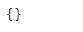
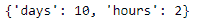

# Python |熊猫 tseries . offsets . date offset . kwds

> 原文:[https://www . geeksforgeeks . org/python-pandas-ts eries-offset-date offset-kwds/](https://www.geeksforgeeks.org/python-pandas-tseries-offsets-dateoffset-kwds/)

日期偏移量是熊猫中用于日期范围的一种标准的日期增量。就我们传递的关键字 args 而言，它的工作原理与 relativedelta 完全一样。日期偏移的工作方式如下，每个偏移指定一组符合日期偏移的日期。例如， *Bday* 将该集合定义为工作日(M-F)的日期集合。

可以创建日期偏移量来将日期向前移动给定的有效日期数。例如，可以将 *Bday(2)* 添加到日期中，使其提前两个工作日。如果日期没有在有效日期开始，则首先将其移动到有效日期，然后创建偏移。

熊猫 `**tseries.offsets.DateOffset.kwds**`属性返回应用于给定 DateOffset 对象的关键字参数。如果没有应用 kwds 参数，则返回“{ 0 }”。

> **语法:**pandas . tseries . offset . dateoffset . kwds
> 
> **参数:**无
> 
> **返回:**关键字参数

**示例#1:** 使用`pandas.tseries.offsets.DateOffset.kwds`属性返回应用于给定 DateOffset 对象的关键字参数。

```
# importing pandas as pd
import pandas as pd

# Creating Timestamp
ts = pd.Timestamp('2019-10-10 07:15:11')

# Create the DateOffset
do = pd.tseries.offsets.DateOffset(n = 2)

# Print the Timestamp
print(ts)

# Print the DateOffset
print(do)
```

**输出:**


现在，我们将把 dateoffset 添加到给定的 timestamp 对象中，以从给定的日期创建一个 2 天的偏移量。还返回应用于给定日期偏移量对象的关键字参数。

```
# Adding the dateoffset to the given timestamp
new_timestamp = ts + do

# Print the updated timestamp
print(new_timestamp)

# Now we will print the key word arguments
# applied on the given DateOffset object
print(do.kwds)
```

**输出:**




正如我们在输出中看到的，该属性已经成功地返回了应用于给定 DateOffset 对象的关键字参数。由于没有应用**kwds 参数，因此打印了“{ 0 }”。

**示例#2:** 使用`pandas.tseries.offsets.DateOffset.kwds`属性返回应用于给定 DateOffset 对象的关键字参数。

```
# importing pandas as pd
import pandas as pd

# Creating Timestamp
ts = pd.Timestamp('2019-10-10 07:15:11')

# Create the DateOffset
do = pd.tseries.offsets.DateOffset(days = 10, hours = 2)

# Print the Timestamp
print(ts)

# Print the DateOffset
print(do)
```

**输出:**


现在，我们将把 dateoffset 添加到给定的时间戳对象中，以从给定的日期创建一个 10 天 2 小时的偏移量。还返回应用于给定日期偏移量对象的关键字参数。

```
# Adding the dateoffset to the given timestamp
new_timestamp = ts + do

# Print the updated timestamp
print(new_timestamp)

# Now we will print the key word arguments
# applied on the given DateOffset object
print(do.kwds)
```

**输出:**




正如我们在输出中看到的，该属性已经成功地返回了应用于给定 DateOffset 对象的关键字参数。