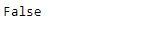
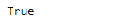

# Python | Pandas tseries . offset . date offset . normalize

> 原文:[https://www . geeksforgeeks . org/python-pandas-ts eries-offset-date offset-normalize/](https://www.geeksforgeeks.org/python-pandas-tseries-offsets-dateoffset-normalize/)

日期偏移量是熊猫中用于日期范围的一种标准的日期增量。就我们传递的关键字 args 而言，它的工作原理与 relativedelta 完全一样。日期偏移的工作方式如下，每个偏移指定一组符合日期偏移的日期。例如， *Bday* 将该集合定义为工作日(M-F)的日期集合。

可以创建日期偏移量来将日期向前移动给定的有效日期数。例如，可以将 *Bday(2)* 添加到日期中，使其向前移动两个工作日。如果日期没有在有效日期开始，则首先将其移动到有效日期，然后创建偏移。

熊猫 `**tseries.offsets.DateOffset.normalize**`属性返回布尔值。当日期偏移值被归一化时，它返回`True`，否则它返回`False`。

**注意:**规格化意味着将日期偏移量相加的结果四舍五入到前一个午夜。

> **语法:**pandas . tseries . offset . datepoffset . normalize
> 
> **参数:**无
> 
> **返回:**布尔值

**示例#1:** 使用`pandas.tseries.offsets.DateOffset.normalize`属性检查给定的日期偏移值是否已经标准化。

```
# importing pandas as pd
import pandas as pd

# Creating Timestamp
ts = pd.Timestamp('2019-10-10 07:15:11')

# Create the DateOffset
do = pd.tseries.offsets.DateOffset(n = 2)

# Print the Timestamp
print(ts)

# Print the DateOffset
print(do)
```

**输出:**


现在我们将向给定的时间戳对象添加 dateoffset 来增加它。我们还将检查日期偏移量是否已经标准化。

```
# Adding the dateoffset to the given timestamp
new_timestamp = ts + do

# Print the updated timestamp
print(new_timestamp)

# check if the DateOffset has been normalized or not
print(do.normalize)
```

**输出:**




正如我们在输出中看到的，属性已经成功地返回了一个布尔值，该值指示给定的日期偏移量是否已经被规范化。

**示例#2:** 使用`pandas.tseries.offsets.DateOffset.normalize`属性检查给定的日期偏移值是否已经标准化。

```
# importing pandas as pd
import pandas as pd

# Creating Timestamp
ts = pd.Timestamp('2019-10-10 07:15:11')

# Create the DateOffset
# Also normalize it
do = pd.tseries.offsets.DateOffset(days = 10, hours = 2, normalize = True)

# Print the Timestamp
print(ts)

# Print the DateOffset
print(do)
```

**输出:**


现在我们将向给定的时间戳对象添加 dateoffset 来增加它。我们还将检查日期偏移量是否已经标准化。

```
# Adding the dateoffset to the given timestamp
new_timestamp = ts + do

# Print the updated timestamp
print(new_timestamp)

# check if the DateOffset has been normalized or not
print(do.normalize)
```

**输出:**




正如我们在输出中看到的，属性已经成功地返回了一个布尔值，该值指示给定的日期偏移量是否已经被规范化。