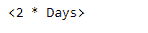
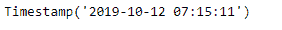
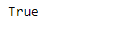
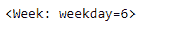
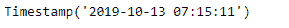
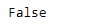

# Python |熊猫 tseries . offsets . dateoffset . onffset

> 哎哎哎:# t0]https://www . geeksforgeeks . org/python 熊猫-tseries 偏移-date offset-onffset/

日期偏移量是熊猫中用于日期范围的一种标准的日期增量。就我们传递的关键字 args 而言，它的工作原理与 relativedelta 完全一样。日期偏移的工作方式如下，每个偏移指定一组符合日期偏移的日期。例如， *Bday* 将该集合定义为工作日(M-F)的日期集合。

可以创建日期偏移量来将日期向前移动给定的有效日期数。例如，可以将 *Bday(2)* 添加到日期中，使其提前两个工作日。如果日期没有在有效日期开始，则首先将其移动到有效日期，然后创建偏移。

熊猫 `**tseries.offsets.DateOffset.onOffset()**`函数返回一个布尔值。如果给定的日期偏移量从过去的日期开始设置，则返回`True`，否则返回`False`。

> **语法:**pantas . tseries . offset . datefoffset . onoffset()
> 
> **参数:**无
> 
> **返回:**布尔值

**示例#1:** 使用`pandas.tseries.offsets.DateOffset.onOffset()`功能检查对于给定的日期偏移量，过去的日期是否为“开”。

```py
# importing pandas as pd
import pandas as pd

# importing the to_offset function
from pandas.tseries.frequencies import to_offset

# Creating Timestamp
ts = pd.Timestamp('2019-10-10 07:15:11')

# Create the DateOffset of 2 day
do = to_offset(freq = '2D')

# Print the Timestamp
print(ts)

# Print the DateOffset
print(do)
```

**输出:**




现在，我们将向给定的时间戳对象添加 dateoffset，以增加 datetime 值。我们还将检查给定的日期偏移量是否是给定日期的开偏移量。

```py
# Adding the dateoffset to the given timestamp
new_timestamp = ts + do

# Print the updated timestamp
print(new_timestamp)

# Now we will check if the given DateOffset
# is onOffset from the passed date
print(do.onOffset())
```

**输出:**





正如我们在输出中看到的，函数返回了`True`，表明给定的日期偏移量是从过去日期开始的一个集合。

**示例#2:** 使用`pandas.tseries.offsets.DateOffset.onOffset()`功能检查对于给定的日期偏移量，过去的日期是否为“开”。

```py
# importing pandas as pd
import pandas as pd

# importing the to_offset function
from pandas.tseries.frequencies import to_offset

# Creating Timestamp
ts = pd.Timestamp('2019-10-10 07:15:11')

# Create the DateOffset
do = to_offset(freq = 'W-SUN')

# Print the Timestamp
print(ts)

# Print the DateOffset
print(do)
```

**输出:**




现在，我们将向给定的时间戳对象添加 dateoffset，以增加 datetime 值。我们还将检查给定的日期偏移量是否是给定日期的开偏移量。

```py
# Adding the dateoffset to the given timestamp
new_timestamp = ts + do

# Print the updated timestamp
print(new_timestamp)

# Now we will check if the given DateOffset
# is onOffset from the passed date
print(do.onOffset())
```

**输出:**





正如我们在输出中看到的，函数返回了`False`，表明给定的日期偏移量不是从过去的日期开始设置的。