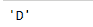

# Python | Pandas ts eries . offset . Dateoffset . rule _ code

> 原文:[https://www . geeksforgeeks . org/python-pandas-ts eries-offset-date offset-rule _ code/](https://www.geeksforgeeks.org/python-pandas-tseries-offsets-dateoffset-rule_code/)

日期偏移量是熊猫中用于日期范围的一种标准的日期增量。就我们传递的关键字 args 而言，它的工作原理与 relativedelta 完全一样。日期偏移的工作方式如下，每个偏移指定一组符合日期偏移的日期。例如， *Bday* 将该集合定义为工作日(M-F)的日期集合。

可以创建日期偏移量来将日期向前移动给定的有效日期数。例如，可以将 *Bday(2)* 添加到日期中，使其提前两个工作日。如果日期没有在有效日期开始，则首先将其移动到有效日期，然后创建偏移。

熊猫 `**tseries.offsets.DateOffset.rule_code**`属性返回应用于给定日期偏移对象的规则代码。例如，月的规则代码是“月”。

> **语法:**
> pandas . tseries . offset . dateoffset . rule _ code
> 
> **参数:**无
> 
> **返回:**规则 _ 代码

**示例#1:** 使用`pandas.tseries.offsets.DateOffset.rule_code`属性返回应用于给定日期偏移对象的规则代码。

```
# importing pandas as pd
import pandas as pd

# importing the to_offset function
from pandas.tseries.frequencies import to_offset

# Creating Timestamp
ts = pd.Timestamp('2019-10-10 07:15:11')

# Create the DateOffset of 2 day
do = to_offset(freq = '2D')

# Print the Timestamp
print(ts)

# Print the DateOffset
print(do)
```

**输出:**


现在，我们将向给定的时间戳对象添加 dateoffset，以增加 datetime 值。我们还将返回应用于给定日期偏移对象的规则代码。

```
# Adding the dateoffset to the given timestamp
new_timestamp = ts + do

# Print the updated timestamp
print(new_timestamp)

# Now we will print the rule_code applied
# on the given DateOffset object
print(do.rule_code)
```

**输出:**




正如我们在输出中看到的，该属性已经成功返回了应用于给定 Dateoffset 对象的 rule_code。

**示例#2:** 使用`pandas.tseries.offsets.DateOffset.rule_code`属性返回应用于给定日期偏移对象的规则代码。

```
# importing pandas as pd
import pandas as pd

# importing the to_offset function
from pandas.tseries.frequencies import to_offset

# Creating Timestamp
ts = pd.Timestamp('2019-10-10 07:15:11')

# Create the DateOffset
do = to_offset(freq = '10D2H')

# Print the Timestamp
print(ts)

# Print the DateOffset
print(do)
```

**输出:**


现在，我们将向给定的时间戳对象添加 dateoffset，以增加 datetime 值。我们还将返回应用于给定日期偏移对象的规则代码。

```
# Adding the dateoffset to the given timestamp
new_timestamp = ts + do

# Print the updated timestamp
print(new_timestamp)

# Now we will print the rule_code applied
# on the given DateOffset object
print(do.rule_code)
```

**输出:**


正如我们在输出中看到的，该属性已经成功返回了应用于给定 Dateoffset 对象的 rule_code。