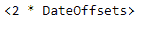
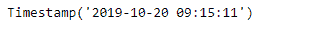

# Python |熊猫 tseries.offsets.DateOffset

> 哎哎哎:# t0]https://www . geeksforgeeks . org/python 熊猫-tseries 偏移-dateoffset/

日期偏移量是熊猫中用于日期范围的一种标准的日期增量。就我们传递的关键字 args 而言，它的工作原理与 relativedelta 完全一样。日期偏移的工作方式如下，每个偏移指定一组符合日期偏移的日期。例如， *Bday* 将该集合定义为工作日(M-F)的日期集合。

可以创建日期偏移量来将日期向前移动给定的有效日期数。例如，可以将 *Bday(2)* 添加到日期中，使其提前两个工作日。如果日期没有在有效日期开始，则首先将其移动到有效日期，然后创建偏移。

熊猫 `**tseries.offsets.DateOffset**`用于创建一个日期范围的标准日期增量。

> **语法:**pandas . tseries . offset . datepoffset(n = 1，normalize=False，**kwds)
> 
> **参数:**
> **n :** 偏移量代表的时间段数。
> **规格化:**是否将日期偏移量相加的结果四舍五入到前一个午夜。
> **级别:** int，str，默认无
> ****kwds :** 添加或替换偏移值的时间参数。增加偏移的参数(如时间增量):年、月等。
> 
> **返回:**日期偏移量

**示例#1:** 使用`pandas.tseries.offsets.DateOffset`功能创建 2 天的日期偏移。

```
# importing pandas as pd
import pandas as pd

# Creating Timestamp
ts = pd.Timestamp('2019-10-10 07:15:11')

# Create the DateOffset
do = pd.tseries.offsets.DateOffset(n = 2)

# Print the Timestamp
print(ts)

# Print the DateOffset
print(do)
```

**输出:**




现在，我们将把 dateoffset 添加到给定的 timestamp 对象中，以从给定的日期创建一个 2 天的偏移量。

```
# Adding the dateoffset to the given timestamp
new_timestamp = ts + do

# Print the updated timestamp
print(new_timestamp)
```

**输出:**


正如我们在输出中看到的，我们已经成功地创建了一个 2 天的偏移量，并将其添加到给定的时间戳对象中，以将日期向前移动 2 天。

**示例 2:** 使用`pandas.tseries.offsets.DateOffset`功能创建 10 天 2 小时的日期偏移。

```
# importing pandas as pd
import pandas as pd

# Creating Timestamp
ts = pd.Timestamp('2019-10-10 07:15:11')

# Create the DateOffset
do = pd.tseries.offsets.DateOffset(days = 10, hours = 2)

# Print the Timestamp
print(ts)

# Print the DateOffset
print(do)
```

**输出:**


现在，我们将把 dateoffset 添加到给定的时间戳对象中，以从给定的日期创建一个 10 天 2 小时的偏移量。

```
# Adding the dateoffset to the given timestamp
new_timestamp = ts + do

# Print the updated timestamp
print(new_timestamp)
```

**输出:**



正如我们在输出中看到的，我们已经成功地创建了一个 10 天 2 小时的偏移量，并将其添加到给定的时间戳对象中，以将日期向前移动 10 天 2 小时。