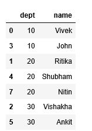
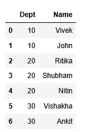
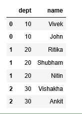

# 使用熊猫进行列到行转置的 Python 程序

> 原文:[https://www . geesforgeks . org/python-program-for-column-to-row-transpose-use-pandas/](https://www.geeksforgeeks.org/python-program-for-column-to-row-transpose-using-pandas/)

给定一个具有列“部门”和“名称”的输入文件，执行一个将列值转换为行的操作。名称包含属于由“部门”列标识的特定部门的管道分隔值

**附加数据集:** [emp_data](https://contribute.geeksforgeeks.org/wp-content/uploads/emp_data.txt)

**示例:**

```py
Input:
dept, name
10, Vivek|John
20, Ritika|Shubham|Nitin
30, Vishakha|Ankit

Output:
dept, name
10, Vivek
10, John
20, Ritika
20, Shubham
20, Nitin
30, Vishakha
30, Ankit

```

**方法一:**蟒道

```py
# Reading Data From the text
# file
data = pd.read_csv(r'GFG.txt')

# create new data frame with 
# split value columns seperates
# data into three columns as per
# separator mentioned
new = data["name"].str.split("|",expand = True) 

# making separate first name column
# from new data frame assign columnn
# values to dataframe new columns
# named as name*
data["Name1"] = new[0]
data["Name2"] = new[1]
data["Name3"] = new[2]

# Dropping old Name columns 
data.drop(columns =["name"], inplace = True) 

# create seperate dataframes with two
# columns id,name
d_name1 = data[['dept','Name1']]
d_name2 = data[['dept','Name2']]
d_name3 = data[['dept','Name3']]

# perform concat/unions operation for
# vertical merging of dataframes
union_df=pd.concat([d_name1,d_name2,d_name3],ignore_index=True)
union_df.fillna('',inplace=True)

# concatenate values of series into one
# series "name"
union_df['name'] = union_df['Name1'].astype(str)+union_df['Name2'].astype(str)+union_df['Name3'].astype(str)

# drop column names
union_df.drop(['Name1','Name2','Name3'],axis=1,inplace=True)

# drop rows having empty values
final_df=union_df[union_df['name']!='']

# sort the dataframe data by dept values
final_df.sort_values('dept')
```

**输出:**


**注意:**上述方法的缺点是当用|

**方法二:**探索熊猫

```py
emp_df = pd.read_csv(r'GFG.txt')

# split column data on basis of seperator
# convert it into list using to_list
# stack method performs transpose operation
# to the data
emp_df1 = pd.DataFrame(emp_df.name.str.split('|').to_list(),
                       index = emp_df.dept).stack()

emp_df1 = emp_df1.reset_index([0, 'dept'])
emp_df1.columns =['Dept', 'Name']

emp_df1
```

**输出:**



**方法三:**熊猫方式:爆炸()

```py
df = pd.read_csv(r'GFG.txt')

# seperate values using split()
# transpose is performed by explode 
# function explode function overcomes 
# the method1 shortcomings incase we
# have many columns we explode will do
# the task in no time and with no hassle
df1 = df.assign(name = df['name'].str.split('|')).explode('name')
df1
```

**输出:**
