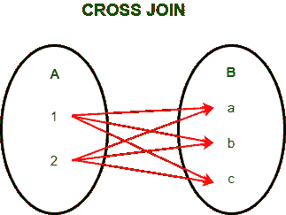
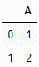
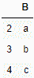
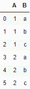
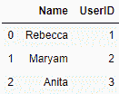
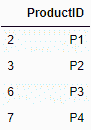
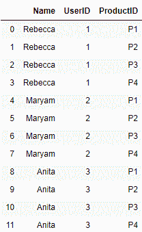
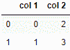
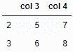
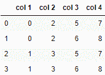

# Python 程序在熊猫中执行交叉连接

> 原文:[https://www . geesforgeks . org/python-程序执行-交叉加入-pandas/](https://www.geeksforgeeks.org/python-program-to-perform-cross-join-in-pandas/)

在熊猫中，[有参数在两个数据帧或系列上执行左、右、内或外合并和连接](https://www.geeksforgeeks.org/python-pandas-merging-joining-and-concatenating/)。然而，目前还不可能使用`how="cross"`参数执行交叉连接来合并或连接两个方法。

**交叉连接:**



**例 1:**

上面的例子证明如下

```
# importing pandas module
import pandas as pd 

# Define a dictionary with column A
data1 = {'A': [1, 2]} 

# Define another dictionary with column B
data2 = {'B': ['a', 'b', 'c']}  

# Convert the dictionary into DataFrame  
df = pd.DataFrame(data1, index =[0, 1])

# Convert the dictionary into DataFrame  
df1 = pd.DataFrame(data2, index =[2, 3, 4]) 

# Now to perform cross join, we will create
# a key column in both the DataFrames to 
# merge on that key.
df['key'] = 1
df1['key'] = 1

# to obtain the cross join we will merge 
# on the key and drop it.
result = pd.merge(df, df1, on ='key').drop("key", 1)

result
```

**数据帧 1:** 
**数据帧 2 :** 
**输出:** 

**例 2:**

用户和产品的两个数据框交叉连接。

```
# importing pandas module
import pandas as pd 

# Define a dictionary containing user ID
data1 = {'Name': ["Rebecca", "Maryam", "Anita"],
        'UserID': [1, 2, 3]} 

# Define a dictionary containing product ID 
data2 = {'ProductID': ['P1', 'P2', 'P3', 'P4']} 

# Convert the dictionary into DataFrame  
df = pd.DataFrame(data1, index =[0, 1, 2])

# Convert the dictionary into DataFrame  
df1 = pd.DataFrame(data2, index =[2, 3, 6, 7]) 

# Now to perform cross join, we will create
# a key column in both the DataFrames to 
# merge on that key.
df['key'] = 1
df1['key'] = 1

# to obtain the cross join we will merge on 
# the key and drop it.
result = pd.merge(df, df1, on ='key').drop("key", 1)

result
```

**数据帧 1:** 
**数据帧 2 :** 
**输出:** 

**例 3:**

```
# importing pandas module
import pandas as pd 

# Define a dictionary with two columns
data1 = {'col 1': [0, 1],
        'col 2': [2, 3]} 

# Define another dictionary 
data2 = {'col 3': [5, 6],
        'col 4': [7, 8]}  

# Convert the dictionary into DataFrame  
df = pd.DataFrame(data1, index =[0, 1])

# Convert the dictionary into DataFrame  
df1 = pd.DataFrame(data2, index =[2, 3]) 

# Now to perform cross join, we will create
# a key column in both the DataFrames to
# merge on that key.
df['key'] = 1
df1['key'] = 1

# to obtain the cross join we will merge on 
# the key and drop it.
result = pd.merge(df, df1, on ='key').drop("key", 1)

result
```

**数据帧 1:** 
**数据帧 2 :** 
**输出:** 