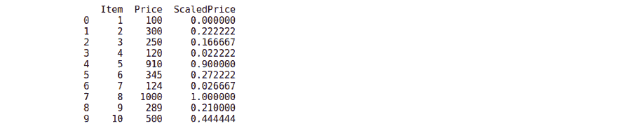
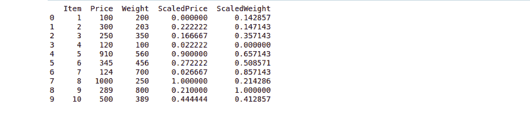
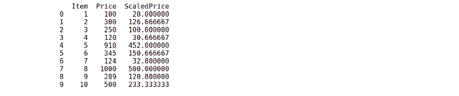

# Python–用熊猫逐列缩放数字

> 原文:[https://www . geesforgeks . org/python-缩放-数字-逐列-带熊猫/](https://www.geeksforgeeks.org/python-scaling-numbers-column-by-column-with-pandas/)

机器学习中的缩放数字是一种常见的预处理技术，用于在固定范围内标准化数据中存在的独立特征。当应用于 Python 序列(如 Pandas 系列)时，缩放会产生一个新的序列，这样一列中的所有值都在一个范围内。例如，如果范围是(0，1)，则该列中的整个数据将仅在范围 0，1 内。

**示例:**

```
if the sequence is [1, 2, 3]
then the scaled sequence is [0, 0.5, 1]
```

**应用:**

*   在机器学习中，缩放可以提高各种算法的收敛速度。
*   通常在机器学习中，您会遇到具有巨大差异的数据集，并且许多机器学习模型很难很好地处理这些数据，因此在这种情况下，缩放有助于将数据保持在一定范围内。

**注意:**我们将使用本文中的 Scikit-learn 来缩放熊猫数据框。

**步骤:**

1.  进口[蟒蛇](https://www.geeksforgeeks.org/python-programming-language/)的[熊猫](https://www.geeksforgeeks.org/python-pandas-dataframe/)和 [sklearn](https://www.geeksforgeeks.org/learning-model-building-scikit-learn-python-machine-learning-library/) 图书馆。
2.  调用[数据框](https://www.geeksforgeeks.org/python-pandas-dataframe/)构造函数返回一个新的数据框。
3.  创建一个 sklearn . preferencing . MinMaxScaler 的实例。
4.  调用 sklearn . preminding . MinMaxScaler . fit _ transform(df[[column _ name]])返回第一步的熊猫数据帧 df，指定的列最小-最大缩放。

**例 1 :**

一个非常基本的例子

## 蟒蛇 3

```
# importing the required libraries
import pandas as pd
from sklearn.preprocessing import MinMaxScaler

# creating a dataframe for example
pd_data = pd.DataFrame({
    "Item": [1, 2, 3, 4, 5, 6, 7, 8, 9, 10],
    "Price": [100, 300, 250, 120, 910, 345, 124, 1000, 289, 500]
})

# Creating an instance of the sklearn.preprocessing.MinMaxScaler()
scaler = MinMaxScaler()

# Scaling the Price column of the created dataFrame and storing
# the result in ScaledPrice Column
pd_data[["ScaledPrice"]] = scaler.fit_transform(pd_data[["Price"]])

print(pd_data)
```

**输出:**



**例 2 :** 你也可以一次缩放多个熊猫、DataFrame 的列，你只需要在 MinMaxScaler.fit_transform()函数中传递列名即可。

## 蟒蛇 3

```
# importing the required libraries
import pandas as pd
from sklearn.preprocessing import MinMaxScaler

# creating a dataframe for example
pd_data = pd.DataFrame({
    "Item": [1, 2, 3, 4, 5, 6, 7, 8, 9, 10],
    "Price": [100, 300, 250, 120, 910, 345, 124, 1000, 289, 500],
    "Weight": [200, 203, 350, 100, 560, 456, 700, 250, 800, 389]
})

# Creating an instance of the sklearn.preprocessing.MinMaxScaler()
scaler = MinMaxScaler()

# Scaling the Price column of the created dataFrame and storing
# the result in ScaledPrice Column
pd_data[["ScaledPrice", "ScaledWeight"]] = scaler.fit_transform(
    pd_data[["Price", "Weight"]])

print(pd_data)
```

**输出:**



**示例 3:** 默认情况下，MinMaxScaler()类使用的比例值为(0，1)，但您可以根据需要将其更改为任何值。

## 蟒蛇 3

```
# importing the required libraries
import pandas as pd
from sklearn.preprocessing import MinMaxScaler

# creating a dataframe for example
pd_data = pd.DataFrame({
    "Item": [1, 2, 3, 4, 5, 6, 7, 8, 9, 10],
    "Price": [100, 300, 250, 120, 910, 345, 124, 1000, 289, 500]
})

# Creating an instance of the sklearn.preprocessing.MinMaxScaler()
# specifying the min and max value of the scale
scaler = MinMaxScaler(feature_range=(20, 500))

# Scaling the Price column of the created dataFrame
# and storing the result in ScaledPrice Column
pd_data[["ScaledPrice"]] = scaler.fit_transform(pd_data[["Price"]])

print(pd_data)
```

**输出:**

