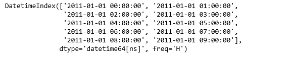
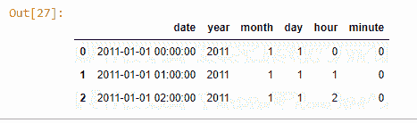
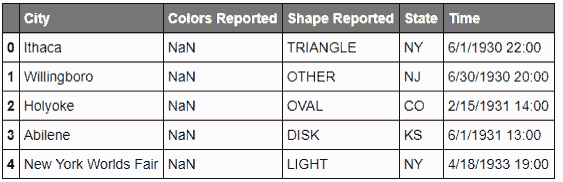
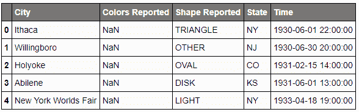

# Python |使用熊猫处理日期和时间

> 原文:[https://www . geesforgeks . org/python-使用日期和时间工作-pandas/](https://www.geeksforgeeks.org/python-working-with-date-and-time-using-pandas/)

在处理数据时，遇到时间序列数据是非常常见的。熊猫是处理时间序列数据的非常有用的工具。

熊猫提供了一套不同的工具，我们可以用它来完成所有关于日期时间数据的必要任务。让我们试着用下面讨论的例子来理解。

**代码#1:** 创建日期数据框

## 蟒蛇 3

```py
import pandas as pd

# Create dates dataframe with frequency 
data = pd.date_range('1/1/2011', periods = 10, freq ='H')

data
```

**输出:**



**代码#2:** 创建日期范围并显示基本特征

## 蟒蛇 3

```py
# Create date and time with dataframe
data = pd.date_range('1/1/2011', periods = 10, freq ='H')

x = datetime.now()
x.month, x.year
```

**输出:**

```py
(9, 2018)
```

**Datetime** 特征可以分为两类。一段时间内的第一个时刻，以及特定时期后的第二个时刻。这些特性对于理解数据中的模式非常有用。

**将给定日期划分为特征–**

**熊猫。Series.dt.year** 返回日期时间的年份。
**熊猫。**返回日期时间的月份。
**熊猫。Series.dt.day** 返回日期时间的当天。
大熊猫。Series.dt.hour 返回日期时间的小时。
**大熊猫。Series.dt.minute** 返回日期时间的分钟。
在此引用[中的所有**日期时间**属性。](https://pandas.pydata.org/pandas-docs/stable/api.html#datetimelike-properties)

**代码#3:** 将日期和时间分割成单独的特征

## 蟒蛇 3

```py
# Create date and time with dataframe
rng = pd.DataFrame()
rng['date'] = pd.date_range('1/1/2011', periods = 72, freq ='H')

# Print the dates in dd-mm-yy format
rng[:5]

# Create features for year, month, day, hour, and minute
rng['year'] = rng['date'].dt.year
rng['month'] = rng['date'].dt.month
rng['day'] = rng['date'].dt.day
rng['hour'] = rng['date'].dt.hour
rng['minute'] = rng['date'].dt.minute

# Print the dates divided into features
rng.head(3)
```

**输出:**



**代码#4:** 要获取当前时间，使用 Timestamp.now()然后将 Timestamp 转换为 datetime，直接访问年、月或日。

## 蟒蛇 3

```py
# Input present datetime using Timestamp
t = pandas.tslib.Timestamp.now()
t
```

```py
Timestamp('2018-09-18 17:18:49.101496')
```

## 蟒蛇 3

```py
# Convert timestamp to datetime
t.to_datetime()
```

```py
datetime.datetime(2018, 9, 18, 17, 18, 49, 101496)
```

## 蟒蛇 3

```py
# Directly access and print the features
t.year
t.month
t.day
t.hour
t.minute
t.second
```

```py
2018
8
25
15
53
```

让我们在一个真实的数据集上分析这个问题。

## 蟒蛇 3

```py
import pandas as pd

url = 'http://bit.ly/uforeports'

# read csv file
df = pd.read_csv(url)          
df.head()
```

**输出:**



## 蟒蛇 3

```py
# Convert the Time column to datetime format
df['Time'] = pd.to_datetime(df.Time)

df.head()
```



## 蟒蛇 3

```py
# shows the type of each column data
df.dtypes
```

```py
City                       object
Colors Reported            object
Shape Reported             object
State                      object
Time               datetime64[ns]
dtype: object
```

## 蟒蛇 3

```py
# Get hour detail from time data
df.Time.dt.hour.head()
```

```py
0    22
1    20
2    14
3    13
4    19
Name: Time, dtype: int64
```

## 蟒蛇 3

```py
# Get name of each date
df.Time.dt.weekday_name.head()
```

```py
0     Sunday
1     Monday
2     Sunday
3     Monday
4    Tuesday
Name: Time, dtype: object
```

## 蟒蛇 3

```py
# Get ordinal day of the year
df.Time.dt.dayofyear.head()
```

```py
0    152
1    181
2     46
3    152
4    108
Name: Time, dtype: int64
```