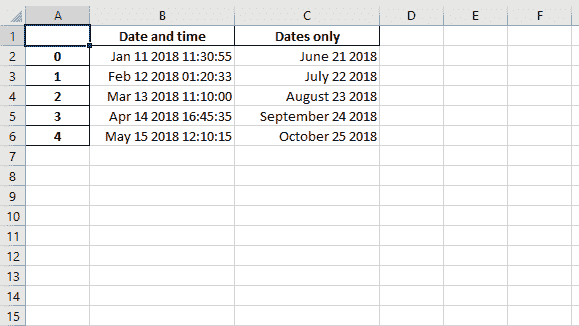
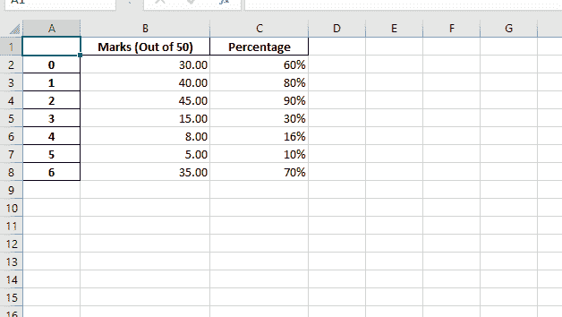
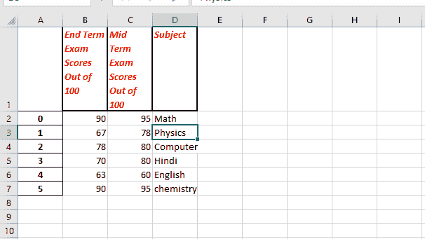

# Python |与熊猫和 XlsxWriter 合作|第 2 集

> 原文:[https://www . geesforgeks . org/python-与熊猫一起工作-和-xlsxwriter-set-2/](https://www.geeksforgeeks.org/python-working-with-pandas-and-xlsxwriter-set-2/)

**先决条件::** [蟒蛇与熊猫和 xlsxwriter 合作|第 1 集](https://www.geeksforgeeks.org/python-working-with-pandas-and-xlsxwriter-set-1/)

Python Pandas 是一个数据分析库。它可以读取、过滤和重新排列大小数据集，并以包括 Excel 在内的一系列格式输出它们。

**熊猫**使用 XlsxWriter 模块编写 Excel 文件。

`XlsxWriter`是一个 Python 模块，用于以 XLSX 文件格式编写文件。它可用于将文本、数字和公式写入多个工作表。此外，它还支持格式、图像、图表、页面设置、自动过滤器、条件格式等功能。

**代码#1 :** 使用 Pandas 和 XlsxWriter 将带有日期时间的 Pandas 数据帧转换为带有默认日期时间和日期格式的 Excel 文件。

```py
# import pandas library as pd
import pandas as pd

# from datetime module import
# datetime and date method
from datetime import datetime, date

# Create a Pandas dataframe from some datetime data.
# datetime(year,month,date,hour,minute,second)
# date(year,month,date)
dataframe = pd.DataFrame({
    'Date and time': [ datetime(2018, 1, 11, 11, 30, 55),
                      datetime(2018, 2, 12, 1,  20, 33),
                      datetime(2018, 3, 13, 11, 10    ),
                      datetime(2018, 4, 14, 16, 45, 35),
                      datetime(2018, 5, 15, 12, 10, 15)],

   'Dates only':    [ date(2018, 6, 21),
                      date(2018, 7, 22),
                      date(2018, 8, 23),
                      date(2018, 9, 24),
                      date(2018, 10, 25) ], })

# Create a Pandas Excel writer 
# object using XlsxWriter as the engine.
# Also set the default datetime and date formats.

# mmmm dd yyyy => month date year
# month - full name, date - 2 digit, year - 4 digit

# mmm d yyyy hh:mm:ss => month date year hour: minute: second
# month - first 3 letters , date - 1 or 2 digit , year - 4 digit.
writer_object = pd.ExcelWriter("Example_datetime.xlsx",
                        engine ='xlsxwriter',
                        datetime_format ='mmm d yyyy hh:mm:ss',
                        date_format ='mmmm dd yyyy')

# Write a dataframe to the worksheet. 
dataframe.to_excel(writer_object, sheet_name ='Sheet1')

# Create xlsxwriter worksheet object
worksheet_object  = writer_object.sheets['Sheet1']

# set width of the B and C column
worksheet_object.set_column('B:C', 20)

# Close the Pandas Excel writer 
# object and output the Excel file. 
writer_object.save()
```

**输出:**


**代码#2 :** 使用 Pandas 和 XlsxWriter 将 Pandas 数据框转换为列格式的 Excel 文件。

```py
# import pandas lib as pd
import pandas as pd

# Create a Pandas dataframe from some data.
dataframe = pd.DataFrame(
    {'Marks (Out of 50)': [30, 40, 45, 15, 8, 5, 35],
     'Percentage': [.6,   .8,   .9,  .3,  .16,   .1,  .7 ], })

# Create a Pandas Excel writer 
# object using XlsxWriter as the engine. 
writer_object = pd.ExcelWriter("Example_column.xlsx",
                                engine ='xlsxwriter')

# Write a dataframe to the worksheet. 
dataframe.to_excel(writer_object, sheet_name ='Sheet1')

# Create xlsxwriter workbook object .
workbook_object = writer_object.book

# Create xlsxwriter worksheet object
worksheet_object = writer_object.sheets['Sheet1']

# Create a new Format object to formats cells 
# in worksheets using add_format() method .

# number taken upto 2 decimal places
# format object is create.
format_object1 = workbook_object.add_format({'num_format': '# 0.00'})

# Integral percentage format object is create.
format_object2 = workbook_object.add_format({'num_format': '0 %'})

# Note: It isn't possible to format
# any cells that already have a format
# such as the index or headers or any
# cells that contain dates or datetimes.

# Set the column width and format.
worksheet_object.set_column('B:B', 20, format_object1)

# Set the column width and format.
worksheet_object.set_column('C:C', 15, format_object2)

# Close the Pandas Excel writer 
# object and output the Excel file. 
writer_object.save()
```

**输出:**


**代码#3 :** 使用 Pandas 和 XlsxWriter 将 Pandas 数据帧转换为用户定义的标题格式的 Excel 文件。

```py
# import pandas lib as pd
import pandas as pd

data1 = ["Math", "Physics", "Computer",
         "Hindi", "English", "chemistry"]
data2 = [95, 78, 80, 80, 60, 95]
data3 = [90, 67, 78, 70, 63, 90]

# Create a Pandas dataframe from some data.
dataframe = pd.DataFrame(
    {'Subject': data1,
     'Mid Term Exam Scores Out of 100' : data2,
     'End Term Exam Scores Out of 100' : data3})

# Create a Pandas Excel writer 
# object using XlsxWriter as the engine. 
writer_object = pd.ExcelWriter("Example_header.xlsx",
                                engine ='xlsxwriter')

# Write a dataframe to the worksheet. 
# we turn off the default header
# and skip one row because we want
# to insert a user defined header there.
dataframe.to_excel(writer_object, sheet_name ='Sheet1', 
                          startrow = 1, header = False)

# Create xlsxwriter workbook object .
workbook_object = writer_object.book

# Create xlsxwriter worksheet object
worksheet_object = writer_object.sheets['Sheet1']

# Create a new Format object to formats cells 
# in worksheets using add_format() method .

# here we create a format object for header.
header_format_object = workbook_object.add_format({
                                'bold': True,
                                'italic' : True,
                                'text_wrap': True,
                                'valign': 'top',
                                'font_color': 'red',
                                'border': 2})

# Write the column headers with the defined format.
for col_number, value in enumerate(dataframe.columns.values):
    worksheet_object.write(0, col_number + 1, value, 
                              header_format_object)

# Close the Pandas Excel writer 
# object and output the Excel file. 
writer_object.save()
```

**输出:**
