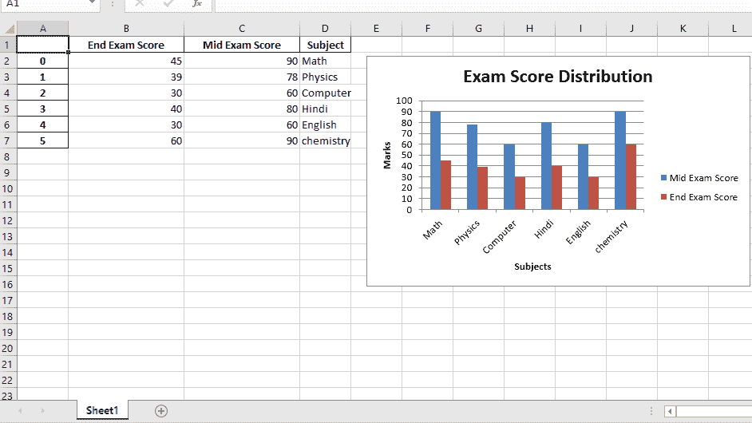
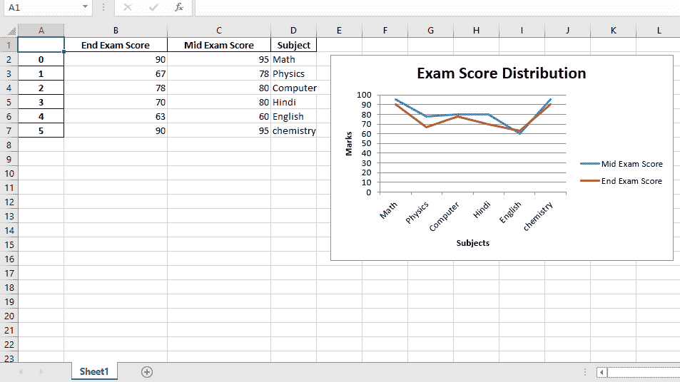
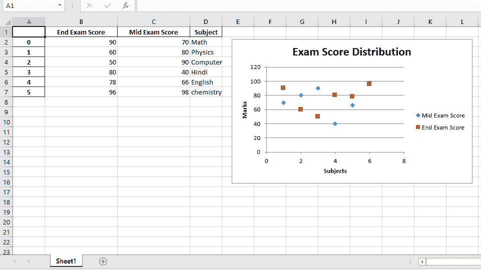

# Python |与熊猫和 XlsxWriter 合作|第 3 集

> 原文:[https://www . geesforgeks . org/python-与熊猫一起工作-和-xlsxwriter-set-3/](https://www.geeksforgeeks.org/python-working-with-pandas-and-xlsxwriter-set-3/)

**先决条件::** [蟒蛇与熊猫和 xlsxwriter 合作|第 1 集](https://www.geeksforgeeks.org/python-working-with-pandas-and-xlsxwriter-set-1/)

Python Pandas 是一个数据分析库。它可以读取、过滤和重新排列大小数据集，并以包括 Excel 在内的一系列格式输出它们。

**熊猫**使用 XlsxWriter 模块编写 Excel 文件。

`XlsxWriter`是一个 Python 模块，用于以 XLSX 文件格式编写文件。它可用于将文本、数字和公式写入多个工作表。此外，它还支持格式、图像、图表、页面设置、自动过滤器、条件格式等功能。

**代码#1 :** 使用 Pandas 和 XlsxWriter 绘制柱形图。

```
# import pandas library as pd
import pandas as pd

# Create a Pandas dataframe from some data.
dataframe = pd.DataFrame({
                    'Subject': ["Math", "Physics", "Computer",
                                "Hindi", "English", "chemistry"],
                   'Mid Exam Score' :  [90, 78, 60, 80, 60, 90],
                   'End Exam Score' : [45, 39, 30, 40, 30, 60] })

# Create a Pandas Excel writer 
# object using XlsxWriter as the engine.
writer_object = pd.ExcelWriter('pandas_column_chart.xlsx',
                                     engine ='xlsxwriter')

# Write a dataframe to the worksheet.
dataframe.to_excel(writer_object, sheet_name ='Sheet1')

# Create xlsxwriter workbook object .
workbook_object = writer_object.book

# Create xlsxwriter worksheet object
worksheet_object = writer_object.sheets['Sheet1']

# set width of the B and C column
worksheet_object.set_column('B:C', 20)

# Create a chart object that can be added  
# to a worksheet using add_chart() method.  

# here we create a column chart object .
chart_object = workbook_object.add_chart({'type': 'column'})

# Add a data series to a chart  
# using add_series method.

# Configure the first series.  
# syntax to define ranges is : 
# [sheetname, first_row, first_col, last_row, last_col].
chart_object.add_series({
    'name':       ['Sheet1', 0, 2],  
    'categories': ['Sheet1', 1, 3, 6, 3],  
    'values':     ['Sheet1', 1, 2, 6, 2],  
    })

# Configure a second series.
chart_object.add_series({
    'name':       ['Sheet1', 0, 1],  
    'categories': ['Sheet1', 1, 3, 6, 3],  
    'values':     ['Sheet1', 1, 1, 6, 1],  
    })

# Add a chart title.
chart_object.set_title({'name': 'Exam Score Distribution'})

# Add x-axis label 
chart_object.set_x_axis({'name': 'Subjects'}) 

# Add y-axis label 
chart_object.set_y_axis({'name': 'Marks'})

# add chart to the worksheet with given
# offset values at the top-left corner of
# a chart is anchored to cell E2
worksheet_object.insert_chart('E2', chart_object, 
                {'x_offset': 20, 'y_offset': 5})

# Close the Pandas Excel writer 
# object and output the Excel file. 
writer_object.save()
```

**输出:**


**代码#2 :** 使用 Pandas 和 XlsxWriter 绘制折线图。

```
# import pandas library as pd
import pandas as pd

# Create a Pandas dataframe from some data.
dataframe = pd.DataFrame({
                    'Subject': ["Math", "Physics", "Computer", 
                                "Hindi", "English", "chemistry"],
                   'Mid Exam Score' :  [95, 78, 80, 80, 60, 95],
                   'End Exam Score' : [90, 67, 78, 70, 63, 90]
                    })

# Create a Pandas Excel writer 
# object using XlsxWriter as the engine.
writer_object = pd.ExcelWriter('pandas_line_chart.xlsx', 
                                   engine ='xlsxwriter')

# Write a dataframe to the worksheet.
dataframe.to_excel(writer_object, sheet_name ='Sheet1')

# Create xlsxwriter workbook object .
workbook_object = writer_object.book

# Create xlsxwriter worksheet object
worksheet_object = writer_object.sheets['Sheet1']

# set width of the B and C column
worksheet_object.set_column('B:C', 20)

# Create a chart object that can be added  
# to a worksheet using add_chart() method.  

# here we create a line chart object .
chart_object = workbook_object.add_chart({'type': 'line'})

# Add a data series to a chart  
# using add_series method.

# Configure the first series.  
# syntax to define ranges is : 
# [sheetname, first_row, first_col, last_row, last_col].
chart_object.add_series({
    'name':       ['Sheet1', 0, 2],  
    'categories': ['Sheet1', 1, 3, 6, 3],  
    'values':     ['Sheet1', 1, 2, 6, 2],  
    })

# Configure a second series.
chart_object.add_series({
    'name':       ['Sheet1', 0, 1],  
    'categories': ['Sheet1', 1, 3, 6, 3],  
    'values':     ['Sheet1', 1, 1, 6, 1],  
    })

# Add a chart title.
chart_object.set_title({'name': 'Exam Score Distribution'})

# Add x-axis label 
chart_object.set_x_axis({'name': 'Subjects'}) 

# Add y-axis label 
chart_object.set_y_axis({'name': 'Marks'})

# add chart to the worksheet with given
# offset values at the top-left corner of
# a chart is anchored to cell E2
worksheet_object.insert_chart('E2', chart_object, 
                 {'x_offset': 20, 'y_offset': 5})

# Close the Pandas Excel writer 
# object and output the Excel file. 
writer_object.save()
```

**输出:**


**代码#3 :** 使用 Pandas 和 XlsxWriter 绘制散点图。

```
# import pandas library as pd
import pandas as pd

# Create a Pandas dataframe from some data.
dataframe = pd.DataFrame({
                    'Subject': ["Math", "Physics", "Computer",
                             "Hindi", "English", "chemistry"],
                   'Mid Exam Score' :  [70, 80, 90, 40, 66, 98],
                   'End Exam Score' : [90, 60, 50, 80, 78, 96]
                    })

# Create a Pandas Excel writer 
# object using XlsxWriter as the engine.
writer_object = pd.ExcelWriter('pandas_Scatter_chart.xlsx',
                                      engine ='xlsxwriter')

# Write a dataframe to the worksheet.
dataframe.to_excel(writer_object, sheet_name ='Sheet1')

# Create xlsxwriter workbook object .
workbook_object = writer_object.book

# Create xlsxwriter worksheet object
worksheet_object = writer_object.sheets['Sheet1']

# set width of the B and C column
worksheet_object.set_column('B:C', 20)

# Create a chart object that can be added  
# to a worksheet using add_chart() method.  

# here we create a scatter chart object .
chart_object = workbook_object.add_chart({'type': 'scatter'})

# Add a data series to a chart  
# using add_series method.

# Configure the first series.  
# syntax to define ranges is : 
# [sheetname, first_row, first_col, last_row, last_col].
chart_object.add_series({
    'name':       ['Sheet1', 0, 2],  
    'categories': ['Sheet1', 1, 3, 6, 3],  
    'values':     ['Sheet1', 1, 2, 6, 2],  
    })

# Configure a second series.
chart_object.add_series({
    'name':       ['Sheet1', 0, 1],  
    'categories': ['Sheet1', 1, 3, 6, 3],  
    'values':     ['Sheet1', 1, 1, 6, 1],  
    })

# Add a chart title.
chart_object.set_title({'name': 'Exam Score Distribution'})

# Add x-axis label 
chart_object.set_x_axis({'name': 'Subjects'}) 

# Add y-axis label 
chart_object.set_y_axis({'name': 'Marks'})

# add chart to the worksheet with given
# offset values at the top-left corner of
# a chart is anchored to cell E2
worksheet_object.insert_chart('E2', chart_object, 
                {'x_offset': 20, 'y_offset': 5})

# Close the Pandas Excel writer 
# object and output the Excel file. 
writer_object.save()
```

**输出:**
