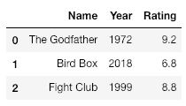
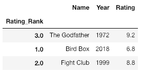
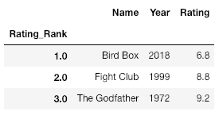
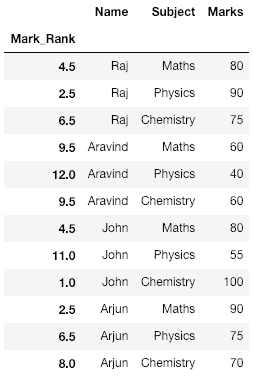
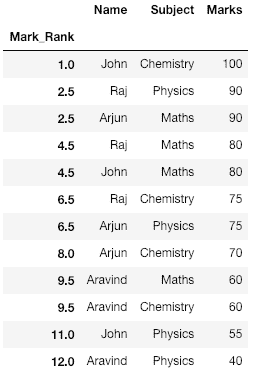

# 排列熊猫数据框的行数

> 原文:[https://www . geesforgeks . org/ranking-rows-of-pandas-data frame/](https://www.geeksforgeeks.org/ranking-rows-of-pandas-dataframe/)

要对熊猫数据框的行进行排名，我们可以使用`DataFrame.rank()` 方法，该方法返回一系列传递的每个相应索引的排名。排序后根据位置返回排名。

**示例#1 :**

在这里，我们将创建一个电影的数据框架，并根据它们的评分对它们进行排名。

```
# import the required packages 
import pandas as pd 

# Define the dictionary for converting to dataframe 
movies = {'Name': ['The Godfather', 'Bird Box', 'Fight Club'],
         'Year': ['1972', '2018', '1999'],
         'Rating': ['9.2', '6.8', '8.8']}

df = pd.DataFrame(movies)
print(df)
```

**输出:**


```
# Create a column Rating_Rank which contains
# the rank of each movie based on rating
df['Rating_Rank'] = df['Rating'].rank(ascending = 1)

# Set the index to newly created column, Rating_Rank
df = df.set_index('Rating_Rank')
print(df)
```

**输出:**


```
# Sort the dataFrame based on the index
df = df.sort_index()
print(df)
```

**输出:**


**例#2**
我们举一个 4 个学生得分的例子。我们将根据学生的最高分对他们进行排名。

```
# Create a dictionary with student details
student_details = {'Name':['Raj', 'Raj', 'Raj', 'Aravind', 'Aravind', 'Aravind',
                             'John', 'John', 'John', 'Arjun', 'Arjun', 'Arjun'],
                   'Subject':['Maths', 'Physics', 'Chemistry', 'Maths', 'Physics',
                             'Chemistry', 'Maths', 'Physics', 'Chemistry', 'Maths',
                                                           'Physics', 'Chemistry'],
                   'Marks':[80, 90, 75, 60, 40, 60, 80, 55, 100, 90, 75, 70]
               }

# Convert dictionary to a DataFrame
df = pd.DataFrame(student_details)
print(df)
```

**输出:**


```
# Create a new column with Marks 
# ranked in descending order
df['Mark_Rank'] = df['Marks'].rank(ascending = 0)

# Set index to newly created column 
df = df.set_index('Mark_Rank')
print(df)
```

**输出:**


```
# Sort the DataFrame based on the index 
df = df.sort_index()

print(df)
```

**输出:**


**解释:**
注意这里我们看到拉杰和阿琼各得 90 分，因此他们的排名是 2.5(第二和第三排名的平均值，即他们共享的两个排名)。对于表中的其他标记也可以看到这一点。