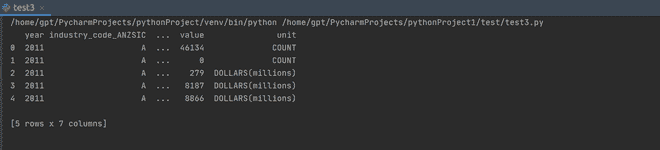
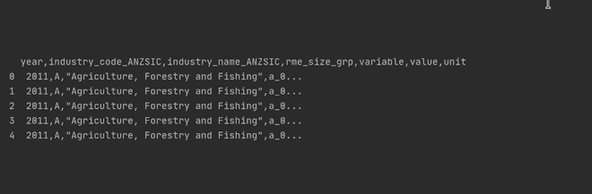

# 将压缩文件作为熊猫数据帧阅读

> 原文:[https://www . geesforgeks . org/read-a-zip-file-as-pands-data frame/](https://www.geeksforgeeks.org/read-a-zipped-file-as-a-pandas-dataframe/)

在本文中，我们将尝试找出如何使用 panda 数据框从 zip 文件中读取数据。

## **为什么我们需要一个 zip 文件？**

人们一起使用相关的文件组，并使文件紧凑，因此通过网络共享它们更容易和更快。Zip 文件非常适合归档，因为它们节省了存储空间。而且，它们对于使用加密方法保护数据也很有用。

**要求:**

**zipfile36 模块:**该模块用于使用简单的 python 程序对 zip 文件执行各种操作。可以使用以下命令安装:

```py
pip install zipfile36
```

**方法#1:** 使用*压缩= zip[中的](https://www.geeksforgeeks.org/python-read-csv-using-pandas-read_csv/)*熊猫. read_csv() 方法。

通过将 *read_csv()* 方法中的*压缩*参数指定为 *zip，*熊猫将首先解压缩 zip，然后从压缩文件中的 csv 文件创建数据帧。

## 蟒蛇 3

```py
# import required modules
import zipfile
import pandas as pd

# read the dataset using the compression zip
df = pd.read_csv('test.zip',compression='zip')

# display dataset
print(df.head())
```

**输出:**



**方法 2:** 打开 zip 文件，得到 CSV 文件。

这里，首先打开压缩文件，提取 CSV 文件，然后从提取的 CSV 文件创建数据帧。

## 蟒蛇 3

```py
# import required modules
import zipfile
import pandas as pd

# open zipped dataset
with zipfile.ZipFile("test.zip") as z:
   # open the csv file in the dataset
   with z.open("test.csv") as f:

      # read the dataset
      train = pd.read_csv(f)

      # display dataset
      print(train.head())
```

**输出:**

