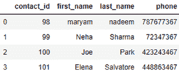

# 使用 SQLAlchemy

将 SQL 数据库表读入熊猫数据框

> 原文:[https://www . geesforgeks . org/read-SQL-database-table-into-a-pands-data frame-using-sqlalchemy/](https://www.geeksforgeeks.org/read-sql-database-table-into-a-pandas-dataframe-using-sqlalchemy/)

要仅使用表名将 sql 表读入数据框，而不执行任何查询，我们在 Pandas 中使用`**read_sql_table()**`方法。此功能不支持 DBAPI 连接。

## read_sql_table()

> **语法:**pandas . read _ SQL _ table(table _ name，con，schema=None，index_col=None，要挟 _float=True，parse _ dates = None，columns=None，chunksize=None)
> 
> **参数:**
> 
> **表名:**(字符串)数据库中 SQL 表的名称。
> 
> **con :** SQLAlchemy 可连接或 str。
> 
> **模式:** (str)要查询的数据库中的 SQL 模式的名称(如果数据库风格支持)。默认值为无
> 
> **index_col :** 字符串或字符串的列表。要设置为索引的列(多索引)。默认值为无。
> 
> **要挟 _ 浮点:** (bool)尝试转换非字符串、非数字对象(如十进制)的值。十进制)到浮点。默认值为真
> 
> **parse _ date:**(列表或字典)
> 
> *   要解析为日期的列名列表。
> *   {column_name: format string}的 Dict，其中格式字符串在解析字符串时间的情况下与 strftime 兼容，或者在解析整数时间戳的情况下是(D，s，ns，ms，us)之一。
> *   {column_name: arg Dict}的 dict，其中 arg dict 对应于 pandas.to_datetime()的关键字参数，对于不支持本机 datetime 的数据库尤其有用，例如 SQLite。
> 
> **列:**从 SQL 表中选择的列名列表。默认值为无
> 
> **chunksize** : (int)如果指定，返回一个迭代器，其中 chunksize 是每个块中要包含的行数。默认值为无。
> 
> **返回类型:**数据帧

**例 1 :**

```py
# import the modules
import pandas as pd 
from sqlalchemy import create_engine

# SQLAlchemy connectable
cnx = create_engine('sqlite:///contacts.db').connect()

# table named 'contacts' will be returned as a dataframe.
df = pd.read_sql_table('contacts', cnx)
print(df)
```

**输出:**


**例 2 :**

```py
# import the modules
import pandas as pd 
from sqlalchemy import create_engine

# SQLAlchemy connectable
cnx = create_engine('sqlite:///students.db').connect()

# table named 'students' will be returned as a dataframe.
df = pd.read_sql_table('students', cnx)
print(df)
```

**输出:**


**例 3 :**

```py
# import the modules
import pandas as pd 
from sqlalchemy import create_engine

# SQLAlchemy connectable
cnx = create_engine('sqlite:///students.db').connect()

# table named 'employee' will be returned as a dataframe.
df = pd.read_sql_table('employee', cnx)
print(df)
```

**输出:**
