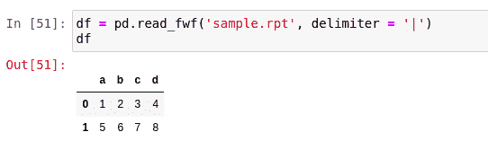
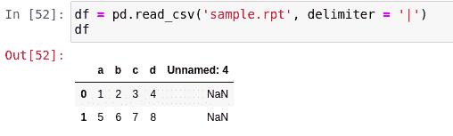

# 用熊猫读取 rpt 文件

> 原文:[https://www . geesforgeks . org/reading-RPT-files-with-pandas/](https://www.geeksforgeeks.org/reading-rpt-files-with-pandas/)

在大多数情况下，我们通常有一个 CSV 文件来加载数据，但也有其他格式，如 JSON、rpt、TSV 等。可以用来存储数据。熊猫为我们提供了从它们那里加载数据的工具。在本文中，我们将看到如何使用 Pandas 从 rpt 文件中加载数据。

RPT 文件是由 Crystal Reports 创建的报告或输出文件，Crystal Reports 是一个用于面向业务的报告的程序。它可以存储来自多个来源和不同类型数据库的数据。

**正在使用的文件:** [在此](https://drive.google.com/file/d/1N7WkOzeXouZU_nYbpqdCvRMVHhXeQjFB/view?usp=sharing)

### 方法 1:使用 read_fwf()读取

读取 rpt 文件的一种方法是简单地使用 read_fwf 方法。您所需要做的就是传递文件路径，它会将数据加载到 dataframe 中，并为其定义分隔符。这就是为什么在 rpt 文件的情况下，理解数据的排列通常变得至关重要。之后，您只需将分隔符和文件名传递给方法。

**示例:**

## 蟒蛇 3

```
import pandas as pd

df = pd.read_fwf('sample.rpt', delimiter='|')

display(df)
```

**输出:**



### 方法 2:使用 read_csv 进行读取

一旦知道了分隔符，还可以使用 [read_csv()](https://www.geeksforgeeks.org/python-read-csv-using-pandas-read_csv/#:~:text=Python%20is%20a%20great%20language,and%20analyzing%20data%20much%20easier.&text=Code%20%231%20%3A%20read_csv%20is%20an,and%20do%20operations%20on%20it.) 方法通过在方法中传递分隔符来读取该文件。让我们使用 read_csv 读取上面的文件。

**示例:**

## 蟒蛇 3

```
import pandas as pd

df = pd.read_csv('sample.rpt', delimiter = '|')

display(df)
```

**输出:**

