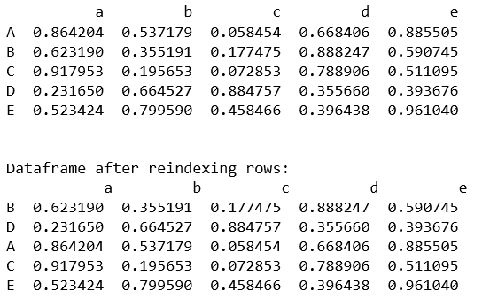
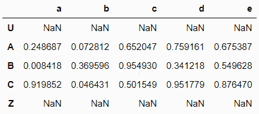
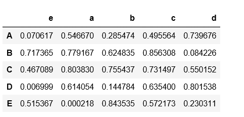
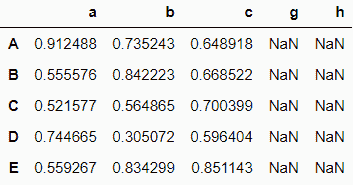
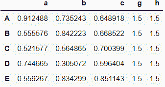
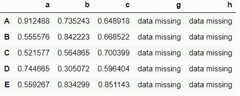

# 熊猫数据框中的重新索引

> 原文:[https://www . geesforgeks . org/reindexing-in-pandas-data frame/](https://www.geeksforgeeks.org/reindexing-in-pandas-dataframe/)

熊猫中的重新索引可用于更改数据框的行和列的索引。索引可以参考与几个熊猫系列或熊猫数据帧相关的许多索引数据结构。让我们看看如何重新索引熊猫数据框中的列和行。

### 重新索引行

可以使用 reindex()方法对单行或多行进行重新索引。数据框中不存在的新索引中的默认值被赋给 NaN。

**示例#1:**

## 蟒蛇 3

```
# import numpy and pandas module
import pandas as pd
import numpy as np

column=['a','b','c','d','e']
index=['A','B','C','D','E']

# create a dataframe of random values of array
df1 = pd.DataFrame(np.random.rand(5,5),
            columns=column, index=index)

print(df1)

print('\n\nDataframe after reindexing rows: \n',
df1.reindex(['B', 'D', 'A', 'C', 'E']))
```

**输出:**



**例 2:**

## 蟒蛇 3

```
# import numpy and pandas module
import pandas as pd
import numpy as np

column = ['a', 'b', 'c', 'd', 'e']
index = ['A', 'B', 'C', 'D', 'E']

# create a dataframe of random values of array
df1 = pd.DataFrame(np.random.rand(5, 5),
        columns = column, index = index)

# create the new index for rows
new_index =['U', 'A', 'B', 'C', 'Z']

print(df1.reindex(new_index))
```

**输出:**



### 使用*轴*关键字对列进行重新索引

通过使用 reindex()方法并通过指定我们要重新索引的轴，可以重新索引一列或多列。数据框中不存在的新索引中的默认值被赋给 NaN。

**示例#1:**

## 蟒蛇 3

```
# import numpy and pandas module
import pandas as pd
import numpy as np

column=['a','b','c','d','e']
index=['A','B','C','D','E']

#create a dataframe of random values of array
df1 = pd.DataFrame(np.random.rand(5,5),
           columns=column, index=index)

column=['e','a','b','c','d']

# create the new index for columns
print(df1.reindex(column, axis='columns'))
```

**输出:**



**例 2:**

## 蟒蛇 3

```
# import numpy and pandas module
import pandas as pd
import numpy as np

column =['a', 'b', 'c', 'd', 'e']
index =['A', 'B', 'C', 'D', 'E']

# create a dataframe of random values of array
df1 = pd.DataFrame(np.random.rand(5, 5),
        columns = column, index = index)

column =['a', 'b', 'c', 'g', 'h']

# create the new index for columns
print(df1.reindex(column, axis ='columns'))
```

**输出:**



### 替换缺失的值

**代码#1:** 数据框中缺少的值可以通过向关键字 fill_value 传递一个值来填充。该关键字替换 NaN 值。

## 蟒蛇 3

```
# import numpy and pandas module
import pandas as pd
import numpy as np

column =['a', 'b', 'c', 'd', 'e']
index =['A', 'B', 'C', 'D', 'E']

# create a dataframe of random values of array
df1 = pd.DataFrame(np.random.rand(5, 5),
        columns = column, index = index)

column =['a', 'b', 'c', 'g', 'h']

# create the new index for columns
print(df1.reindex(column, axis ='columns', fill_value = 1.5))
```

**输出:**



**代码#2:** 用字符串替换缺失的数据。

## 蟒蛇 3

```
# import numpy and pandas module
import pandas as pd
import numpy as np

column =['a', 'b', 'c', 'd', 'e']
index =['A', 'B', 'C', 'D', 'E']

# create a dataframe of random values of array
df1 = pd.DataFrame(np.random.rand(5, 5),
       columns = column, index = index)

column =['a', 'b', 'c', 'g', 'h']

# create the new index for columns
print(df1.reindex(column, axis ='columns', fill_value ='data missing'))
```

**输出:**

