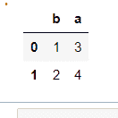
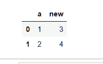

# 通过熊猫中的索引重命名列

> 原文:[https://www . geeksforgeeks . org/rename-按熊猫索引中的列/](https://www.geeksforgeeks.org/rename-column-by-index-in-pandas/)

**先决条件:**T2】熊猫

数据框中的一列可以使用它所在的位置(称为索引)进行更改。只需使用索引就可以重命名一列。本文讨论了所有这些可能的方法。

### **进场:**

*   导入所需的 python 库。
*   创建数据
*   提供要重命名的列的索引作为 rename()函数的参数。

Pandas**rename()**方法用于重命名任何索引、列或行。

> ***语法:**重命名(映射器=无，索引=无，列=无，轴=无，复制=真，位置=假，级别=无)*
> 
> ***参数:***
> 
> *   ***映射器、索引和列:**字典值，键指旧名称，值指新名称。一次只能使用这些参数中的一个。*
> *   ***轴:**整数或字符串值，0/“行”代表行，1/“列”代表列*
> *   ***副本:**如果为真，则复制底层数据。*
> *   ***在位:**如果为真，则对原始数据框进行更改。*
> *   ***级别:**用于指定数据帧有多级索引时的级别。*
> 
> ***返回类型:**新名称数据框*

下面给出了实现我们所需功能的各种实现:

**示例 1:** 使用列索引相互切换两个列名。

## 蟒蛇 3

```py
import pandas as pd

# Sample DataFrame
df = pd.DataFrame({'a': [1, 2], 'b': [3, 4]})

# Changing columns name with index number
df.columns.values[0] = "b"
df.columns.values[1] = "a"

# Display
display(df)
```

**输出:**



**示例 2:** 使用另一种方法用索引重命名列。

## 蟒蛇 3

```py
import pandas as pd

# Sample DataFrame
df = pd.DataFrame({'a': [1, 2], 'b': [3, 4]})

# Changing columns name with index number
su = df.rename(columns={df.columns[1]: 'new'})

# Display
display(su)
```

**输出:**



**示例 3:** 使用索引号在单个命令中重命名两个/多个列。

## 蟒蛇 3

```py
import pandas as pd

# Sample DataFrame
df = pd.DataFrame({'a': [1, 2], 'b': [3, 4], 'c': [7, 8]})

# Changing columns name with index number
mapping = {df.columns[0]: 'new0', df.columns[1]: 'new1'}
su = df.rename(columns=mapping)

# Display
display(su)
```

**输出:**


**示例 4:** 用 CSV 文件的索引号重命名列名。

**正在使用的文件:** Data1.csv

**链接:** [点击此处](https://drive.google.com/file/d/195WZCQsso6tRv4v3bdHO8NWXt2EmgTKR/view?usp=sharing)

## 蟒蛇 3

```py
import pandas as pd

# reading a csv file
df1 = pd.read_csv("data1.csv")

# change 2nd column name with index number
df1.columns.values[2] = "city"

# Display DataFrame
display(df1)
```

**输出:**

