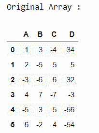
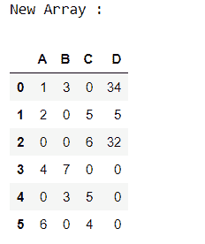

# 熊猫数据框中用零替换负数

> 原文:[https://www . geesforgeks . org/replace-pandas-data frame 中的负数被零替换/](https://www.geeksforgeeks.org/replace-negative-number-by-zeros-in-pandas-dataframe/)

在这篇文章中，让我们讨论如何用零替换熊猫中的负数

**进场:**

*   进口熊猫模块。
*   创建数据框。
*   检查 DataFrame 元素是否小于零，如果是，则在该元素中指定零。
*   显示最终的数据帧

首先，让我们创建数据帧。

## 蟒蛇 3

```
# importing pandas module
import pandas as pd

# Creating pandas DataFrame
df = pd.DataFrame({"A": [1, 2, -3, 4, -5, 6],
                   "B": [3, -5, -6, 7, 3, -2],
                   "C": [-4, 5, 6, -7, 5, 4],
                   "D": [34, 5, 32, -3, -56, -54]})

# Displaying the original DataFrame
print("Original Array : ")
df
```

**输出:**



现在，让我们找到负元素并用零替换它。

## 蟒蛇 3

```
# checking the element is < 0
df[df < 0] = 0
print("New Array :")
df
```

**输出:**

