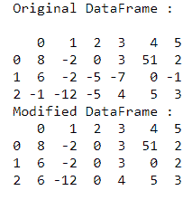
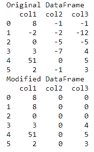

# 用熊猫数据框中最新的前一个正值替换负值

> 原文:[https://www . geesforgeks . org/将-负值-替换为-最近-之前-正值-熊猫-数据框/](https://www.geeksforgeeks.org/replace-negative-values-with-latest-preceding-positive-value-in-pandas-dataframe/)

在本文中，我们将讨论如何用前面最新的正值替换熊猫数据框列中的负值。

这样做时，可能会出现两种情况–

*   如果不存在后续正值，则值保持不变
*   如果不存在后续正值，则值更新为 0

让我们详细讨论这些案例。

**情况 1:如果不存在正数值，数值保持不变**

声明一个变量来存储用某个大的负整数初始化的前一个正值。然后按列执行数据帧的迭代。

*   如果该值为负值，它将被前面的正值变量替换；否则，它将保持不变。
*   并且，如果该值为正值，则更新前面的正值变量。

**示例:**

## 蟒蛇 3

```py
import pandas as pd

# creating a pandas dataframe
df = pd.DataFrame([[8, -2, 0, 3, 51, 2],
                   [6, -2, -5, -7, 0, -1],
                   [-1, -12, -5, 4, 5, 3]])
print("Original DataFrame : \n")
print(df)

# declaring a pre defined value
prec_val = -999

# iterate over columns
for i in range(df.shape[1]):

    # resetting value over each column
    prec_val = -999

    # iterate over rows
    for j in range(df.shape[0]):

        # accessing the cell value
        cell = df.at[j, i]

        # check if cell value is negative
        if(cell < 0):

            # check if prec_val is not default
            # set value
            if(prec_val != -999):

                # replace the cell value
                df.at[j, i] = prec_val
        else:

            # store the latest value in variable
            prec_val = df.at[j, i]

print("Modified DataFrame : ")
print(df)
```

**输出:**



**情况 2:如果不存在正在进行的正值，则值更新为 0**

这种方法使用数据帧屏蔽的概念来替换数据帧的负值。这些值以从上到下的方式从左到右逐列遍历。在这种方法中，最初，数据帧单元中的所有值< 0 被转换为 NaN。

熊猫**[**data frame . ffill()**](https://www.geeksforgeeks.org/python-pandas-dataframe-ffill/)方法用于填充数据帧中缺失的值。这个方法中的“ffill”代表“向前填充”,它向前传播最后一次遇到的有效观察。ffill()函数用于沿指定的索引轴填充缺失的值。此方法具有以下语法:**

> ****语法:**数据框(轴=无，在位=假)**
> 
> ****参数:****
> 
> *   **坐标轴–{ 0，索引 1，列}**
> *   **原地:如果为真，填写原地。**

**接下来是 fillna()方法，使用指定的值填充 NA/NaN 值。这里，我们用 0 填充 NaN 值，因为它是可能的最低正整数值。因此，所有负值都转换为正值。这种方法可以在没有存储任何字符串值的数据帧上工作。如果前面没有正值，则负值被替换为 0。**

## **蟒蛇 3**

```py
import pandas as pd

# creating a pandas dataframe
data_frame = pd.DataFrame({'col1': [8, -2, 0, 3, 51, 2],
                           'col2': [-1, -2, -5, -7, 0, -1],
                           'col3': [-1, -12, -5, 4, 5, 3]})

print("Original DataFrame")
print(data_frame)

# masking the data frame
data_frame = data_frame.mask(data_frame.lt(
    0)).ffill().fillna(0).astype('int32')

print("Modified DataFrame")
print(data_frame)
```

****输出:****

****