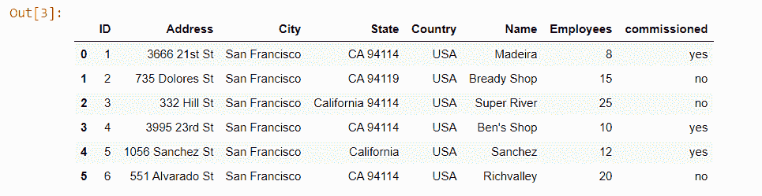
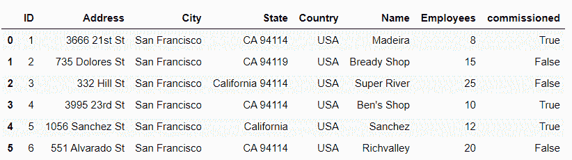

# 在 Python-Pandas 中将包含“是”和“否”值的列替换为“真”和“假”

> 原文:[https://www . geesforgeks . org/replace-the-column-contains-the-values-yes-and-no-with-true-false-in-python-pandas/](https://www.geeksforgeeks.org/replace-the-column-contains-the-values-yes-and-no-with-true-and-false-in-python-pandas/)

让我们讨论一个程序，用**真**和**假**改变包含值**【是】**和**【否】**的列的值。

首先，让我们看一个数据集。

**代码:**

## 蟒蛇 3

```py
# import pandas library
import pandas as pd

# load csv file
df = pd.read_csv("supermarkets.csv")

# show the dataframe
df
```

**输出:**



下载用过的 csv 文件[点击这里。](https://drive.google.com/file/d/1z8sDYXocuG7-Zqw0BjR8cnUnqf3qLeGZ/view)

现在，让我们看看完成这项任务的多种方法:

**方法 1:使用 Series.map()** 。
[此](https://www.geeksforgeeks.org/python-pandas-map/)方法用于映射具有相同一列的两个系列的值。

> **语法:** Series.map(arg，na_action=None)。
> **返回类型:**熊猫系列以同为索引作为调用者。

**示例:**将包含值“是”和“否”的“委托”列替换为“真”和“假”。
T3】代号:

## 蟒蛇 3

```py
# import pandas library
import pandas as pd

# load csv file
df = pd.read_csv("supermarkets.csv")

# replace the ‘commissioned' column contains
# the values 'yes' and 'no'  with 
# True and  False:
df['commissioned'] = df['commissioned'].map(
                   {'yes':True ,'no':False})

# show the dataframe
df
```

**输出:**



**方法 2:使用 DataFrame.replace()** 。
[这个](https://www.geeksforgeeks.org/python-pandas-dataframe-replace/)方法用来替换字符串、正则表达式、列表、字典、序列、数字等。来自数据帧。

> **语法:**数据框. replace(to_replace=None，value=None，inplace=False，limit=None，regex=False，method='pad '，axis=None)
> **返回类型:**更新数据框

**示例:**将包含值“是”和“否”的“委托”列替换为“真”和“假”。
T3】代号:

## 蟒蛇 3

```py
# import pandas library
import pandas as pd

# load csv file
df = pd.read_csv("supermarkets.csv")

# replace the ‘commissioned' column 
# contains the values 'yes' and 'no'
#  with True and  False:
df = df.replace({'commissioned': {'yes': True, 
                                'no': False}})

# show the dataframe
df
```

**输出:**

